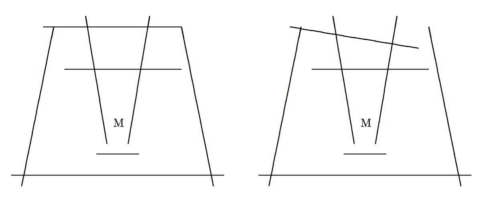

## 문제

Once upon a time when people still believed in magic, there was a great wizard Aranyaka Gondlir. After twenty years of hard training in a deep forest, he had finally mastered ultimate magic, and decided to leave the forest for his home.

Arriving at his home village, Aranyaka was very surprised at the extraordinary desolation. A gloom had settled over the village. Even the whisper of the wind could scare villagers. It was a mere shadow of what it had been.

What had happened? Soon he recognized a sure sign of an evil monster that is immortal. Even the great wizard could not kill it, and so he resolved to seal it with magic. Aranyaka could cast a spell to create a monster trap: once he had drawn a line on the ground with his magic rod, the line would function as a barrier wall that any monster could not get over. Since he could only draw straight lines, he had to draw several lines to complete a monster trap, i.e., magic barrier walls enclosing the monster. If there was a gap between barrier walls, the monster could easily run away through the gap.

For instance, a complete monster trap without any gaps is built by the barrier walls in the left figure, where “M” indicates the position of the monster. In contrast, the barrier walls in the right figure have a loophole, even though it is almost complete.



Your mission is to write a program to tell whether or not the wizard has successfully sealed the monster.

## 입력

The input consists of multiple data sets, each in the following format.

```

n
x1 y1 x'1 y'1
x2 y2 x'2 y'2
    . . .
xn yn x'n y'n
```

The first line of a data set contains a positive integer n, which is the number of the line segments drawn by the wizard. Each of the following n input lines contains four integers x, y, x', and y', which represent the x- and y-coordinates of two points (x, y) and (x', y') connected by a line segment. You may assume that all line segments have non-zero lengths. You may also assume that n is less than or equal to 100 and that all coordinates are between −50 and 50, inclusive.

For your convenience, the coordinate system is arranged so that the monster is always on the origin (0, 0). The wizard never draws lines crossing (0, 0).

You may assume that any two line segments have at most one intersection point and that no three line segments share the same intersection point. You may also assume that the distance between any two intersection points is greater than 10−5.

An input line containing a zero indicates the end of the input.

## 출력

For each data set, print “yes” or “no” in a line. If a monster trap is completed, print “yes”. Otherwise, i.e., if there is a loophole, print “no”.
