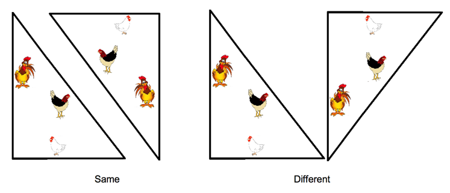

## 문제

Chicken farmer Xiaoyan is getting three new chickens, Lucy, Charlie and CC. She wants to build a chicken pen so that each chicken has its own, unobstructed view of the countryside. The pen will have three straight sides; this will give each chicken its own side so it can pace back and forth without interfering with the other chickens. Xiaoyan finds a roll of chicken wire (fencing) in the barn that is exactly N feet long. She wants to figure out how many different ways she can make a three sided chicken pen such that each side is an integral number of feet, and she uses the entire roll of fence. Different rotations of the same pen are the same, however, reflections of a pen may be different (see below).

## 입력

The first line of input contains a single integer P, (1 ≤ P ≤ 1000), which is the number of data sets that follow. Each data set should be processed identically and independently.

Each data set consists of a single line of input. It contains the length of the roll of fence, N, (3 <= N <= 10000).

## 출력

For each data set there is a single line of output. It contains an integer which is the total number of different three-sided chicken pen configurations that can be made using the entire roll of fence.
