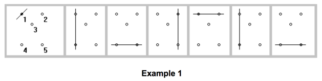
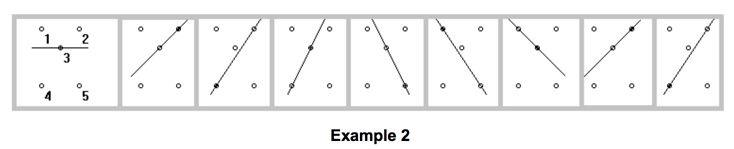

## 문제

A windmill animation works as follows:

A two-dimensional set of points, no three of which lie on a line is chosen. Then one of the points is chosen (as the first pivot) and a line is drawn through the chosen point at some initial angle. The animation proceeds by rotating the line counter-clockwise about the pivot at a constant rate. When the line hits another of the points, that point becomes the new pivot point. In the two examples below, the points are (-1, 1), (1,1), (0,0), (-1,-2) and (1,-2).

In Example 1, the start point is point 1 and the line starts rotated 45 degrees from horizontal. When the line rotates to 90 degrees, point 4 is hit and becomes the new pivot. Then point 5 becomes the new pivot, then point 2 then point 1.

In Example 2, the initial point is point 3 and the line starts horizontal. At 45 degrees, point 2 becomes the pivot, then at about 56 degrees, point 4 becomes the pivot. At about 63 degrees, point 3 becomes the pivot again, then point 5, point 1 and back to 3 as at the start.

Write a program, which takes as input the points of the set, the initial point and the initial line angle and outputs the sequence of pivot points.

## 입력

The first line of input contains a single integer P, (1 ≤ P ≤ 1000), which is the number of data sets that follow. Each data set should be processed identically and independently.

Each data set consists of multiple lines of input. The first line of each data set consists of three space-separated decimal integers followed by a single floating-point value. The first integer is the number of points M to follow (3 <= M <= 20). The second integer gives the number, S, of the pivot points to output (3 <= S <= 20) and the third integer gives the index, I, of the initial point (1 <= I <= M). The floating-point value is the angle, A, in degrees, that the initial line is rotated counter-clockwise from horizontal (0 <= A < 180).

The remaining M lines in the data set contain the coordinates of the set of points. Each line consists of an integer, the point‘s index, I, and two floating-point values, the X and Y coordinates of the point respectively.

## 출력

For each data set there is a single line of output. It contains S space separated point indices (excluding the initial point index).
