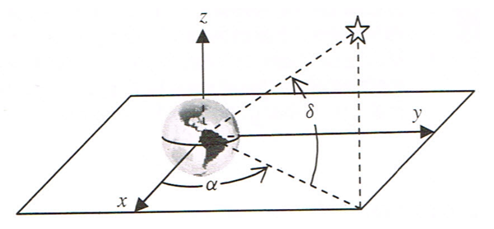

## 문제

Once a Push-To Telescope is setup, it tells you where to point the telescope to see a star in its built-in catalogue by giving an azimuth (counter-clockwise angle in the base plane of the telescope) and elevation (angle above the base plane of the telescope). The telescope is initialized by pointing it at a known star, finding the star in the catalogue and selecting it. This step is repeated with a second known star which is not too close to the first one.

The direction of stars in the catalogue is given in geocentric equatorial coordinates. The origin is the center of the earth. The positive z-axis passes through the North Pole and the xy-plane contains the equator. The x-axis points at the sun at the spring equinox (when the sun is in the equatorial plane). The star coordinates are right ascension, α, (angle in xy-plane counter-clockwise from the x-axis in degrees) and declination, δ, (angle above (positive) or below (negative) the xy-plane).

In this coordinate system, the earth rotates at (2π)(1.0027379093)/86400 radians per second. (Since the earth moves around the sun, it must rotate more than 360 degrees to get the sun over the same point.)

During setup, when you select a star, the system records the time (in seconds since the system was turned on), the azimuth and elevation of the telescope when pointing at the star and the index of the star in the table. After two selections of known stars, the system computes the transformation from geocentric equatorial coordinates to local coordinates. Subsequently, when you select a star to view, the system uses the stars geocentric equatorial coordinates and the current time to compute the azimuth and elevation to point at the star.

Write a program to implement the Push-To Telescope.

Since the telescope coordinate system rotates with the earth, it may be useful to use a rotating geocentric equatorial coordinate system for star coordinates. This system aligns with geocentric equatorial coordinates when the system turns on and rotates with the earth thereafter. In this system, the declination, δ, is the same but the right ascension angle changes with time:

α\_rot = α - t \* rotation\_rate

where α\_rot is the right ascension angle in the rotating system (in radians), is the right ascension angle in geocentric equatorial coordinates (in radians), t is time in seconds since the system was turned on and rotation\_rate is the earth rotation rate above.

## 입력

The first line of input contains two decimal integers separated by a single space. The first integer gives the number, S, of stars in the catalogue (0 < S <= 100) and the second gives the number P of data sets (0 < P < 100).

The next S lines of input are the star table. Each line of the star table consists of two floating-point values separated by spaces. The floating-point values are the right ascension (α) and declination (δ) in degrees. There is one star table, and it is used for all data sets. Each data set should be processed identically and independently using the star table.

The P problem data sets follow the star table data. Each data set consists of several lines. The first line of each data set consists of one decimal integers, the number of stars to find T, (T <= 10) for the data set.

The next two lines specify the setup data for the data set. Each setup line consists of two integers followed by two floating-point values. The integers are t, the number of seconds since the system was started and I, the index of the known setup star in the table. The floating-point values are the azimuth and elevation of the star in degrees (in telescope coordinates).

The remaining T lines of input in the data set specify a star the user wants to observe. Each line of input consists of two integers separated by spaces. The first is the time (in seconds) since the system was started and the second is the index of the star to observe in the star table.

## 출력

There are several lines of output for each data set. For each star that was to be observed, there is one line of output. If the computed elevation is less than zero (the star is below the horizon), the line consists of the string "NOT VISIBLE" (without the quotes). Otherwise the line consists of the azimuth and elevation in degrees to one decimal place.
