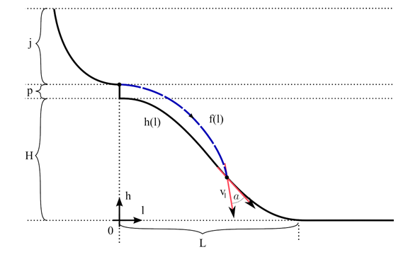
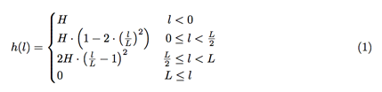
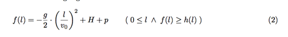
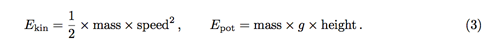
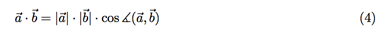

## 문제

스키 점프는 가장 인기있는 겨울 스포츠 대회 중 하나이다. 스키 점프 언덕은 기록을 높이기 위해 점점 커졌다. 선수들의 안전을 위해서 국제 스키 연맹은 착륙 속도와 각도의 최댓값을 정해두었다. 새로 만들어진 스키 점프 경기장이 주어진다. 출발대의 가장 높은 곳에서 출발했을 때, 착륙 속도와 각도를 구하는 프로그램을 작성하시오.

이 문제를 풀기 위해서는 아래와 같은 간단한 물리 지식이 필요하다.

언덕은 다음과 같은 모양이다.

l은 언덕이 시작하는 곳을 원점으로 했을 때, x축 상의 위치이다. H는 언덕의 높이, L은 언덕의 너비이다. j는 스키 점프를 시작할 수 있는 최대 높이이고, p는 점프대와 언덕 꼭대기와의 높이 차이이다. 마찰력과 공기저항은 무시한다면, 선수는 다음과 같은 곡선을 그리며 날아가게 된다.

여기서 v0은 점프할 때의 속도이다. 이 속도는 에너지 보존의 법칙을 이용해서 계산할 수 있다. 포텐셜 에너지와 운동 에너지의 정의는 다음과 같다.

모든 식에서 g는 중력 상수이며, 9.81ms-2로 계산한다.

## 입력

첫째 줄에 테스트 케이스의 개수 t가 주어진다. (0 < t < 160,000)

각 테스트 케이스는 한 줄로 이루어져 있고, j, p, H, L이 주어진다. (0 < j, p, H, L ≤ 500) 모든 값의 단위는 미터이다.

## 출력

각 테스트 케이스에 대해서, 다음과 같은 세 가지 값을 출력한다.

1. x축 상에서 착륙 위치 l

2. 착륙 속도 |vl| (m/s)

3. 언덕에 대한 각도 α (degree)

오차는 10-4까지 허용한다.

## 힌트

두 벡터 a와 b의 내적은 다음과 같이 구할 수 있다.

