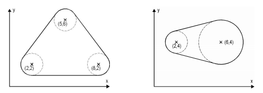

## 문제

연종이는 자신의 마당에 새로운 감시 시스템을 설치하려고 한다.

연종이의 마당에는 N개의 원형 물체가 있다. 감시 시스템의 경계에는 고압 울타리를 설치하려고 한다. 울타리 안의 모든 보안 지역은 연결되어 있어야 한다. 또, 모든 물체는 보안 지역 안에 있어야 한다. 모든 물체는 서로 겹치거나 접하지 않는다. 이때, 울타리의 길이를 최소로 하는 프로그램을 작성하시오.

## 입력

첫째 줄에 테스트 케이스의 개수 C (0 ≤ C ≤ 100)가 주어진다. 각 테스트 케이스의 첫째 줄에는 물체의 개수 N (0 < N ≤ 25)이 주어진다. 다음 N개의 줄에는 각 물체를 나타내는 세 개의 숫자 xi, yi, ri가 주어진다. i번째 물체의 중심 좌표는 (xi, yi)이며, 반지름은 ri이다. (|xi|, |yi| ≤ 100, 0 < ri ≤ 100)

## 출력

각 테스트 케이스에 대해서 모든 물체를 포함하는 울타리 길이의 최솟값을 출력한다. 정답과의 오차는 10-7까지 허용한다.
