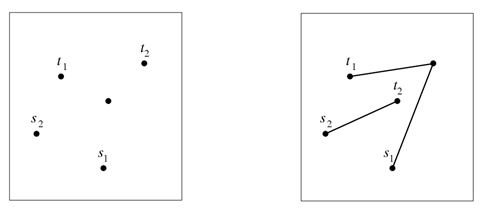

## 문제

Lizarb’s national soccer team undoubtedly belongs to the group of favourites to win the World Cup at the upcoming championship. Their greatest advantages are their excellent dribbling skills and the ball passing precision. Particularly, each player can pass the ball to every other player on the playing field at any distance. The team’s captain, Oicul, claims that an exercise which certainly has a substantial effect on the team’s soccer skills is the so-called “Two-ball Game”.

In the two-ball game, n ≥ 4 kickers are positioned on the playing field and do not move (i.e. change their locations) during the game. Four of the players are distinguished: two of them, denoted as s1 and s2, are called starting players, and two others, denoted as t1 and t2, are called terminal players. At the beginning, player s1 has got a white ball and s2 possesses a black ball. Then each starting player can kick the ball directly to the corresponding terminal player but he can also kick the ball to any other player on the field and this player can pass the ball to the next one, and so on. The aim is that at the end the white ball is in possession of t1 and the black ball in possession of t2. So, it seems the game is quite simple. However, to avoid ball collisions, the constraint of the game is that no ball trajectories cross each other and that no player (including starting and terminal ones) has more than one ball contact. For simplicity, we assume the trajectory of a ball moving from one player to the next one is a line segment.

Lizarb’s national soccer team observed that for some locations of kickers the two-ball game is possible but for some others it is impossible. The figure below shows two example locations: to the left, playing two-ball game is impossible; to the right, playing the game is possible.

Your task is to write a program that checks if for given player locations the two-ball game is possible or not.

## 입력

Each input starts with a single integer that gives the number of cases that follow. The firsts line of each case contains the number of players n, with 4 ≤ n ≤ 100 000 followed by n lines that describe the coordinates of the players. All coordinates are pairwise different and the points determined by the coordinates are not collinear (recall, three or more points are said to be collinear if they lie on a single straight line). The first coordinate describes the location of s1, the second the location of t1, the third coordinate describes the location of s2, and the fourth the location of t2. The remaining coordinates describe positions of other players of the team

## 출력

For each case, your algorithm has to output a line containing POSSIBLE if it is possible to play the game and IMPOSSIBLE, otherwise.
