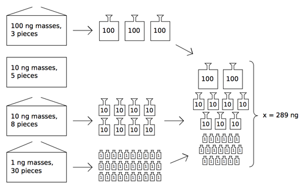

## 문제

Peter is working in a secret chemical laboratory. For his new experiment he needs to measure exactly x nanograms of a secret reagent. He has a balance and several standard masses, and his goal is to choose a set of standard masses with total sum equal to x ng.

Standard masses come in n sealed boxes. The i-th box contains qi identical masses of 10ki ng. Peter wants to open the minimal number of boxes to take a set of masses with the sum of their weights of x ng.

## 입력

The first line of the input file contains two integer numbers x and n (1 ≤ x ≤ 1018, 1 ≤ n ≤ 105). The next n lines contain pairs of numbers ki and qi (0 ≤ ki ≤ 18, 1 ≤ qi · 10ki ≤ 1018).

## 출력

On the first line output the minimal number of boxes that should be opened. On the second line output the numbers of these boxes in any order. Boxes are numbered in the order they appear in the input file starting from 1. If it is impossible to measure exactly x ng, output a single line with −1.
