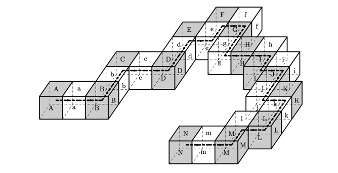
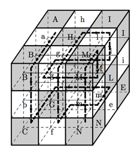

## 문제

스네이크 큐브는 나무 정육면체 27개로 이루어져 있고, 모든 조각은 고무줄로 연결되어 있다. 고무줄은 모든 정육면체의 중심을 지나며, 한 면의 중심으로 들어와서 다른 면의 중심으로 나가게 된다. 첫 번째 정육면체는 들어가는 고무줄 없이 중심에서 고무줄이 시작하게 되며, 마지막 정육면체는 나오는 고무줄 없이 중심에서 고무줄이 끝나게 된다. 따라서, 인접한 정육면체는 공유하는 변의 중심을 기준으로 자유롭게 회전시킬 수 있다. 정육면체는 고무줄로 연결되어 있기 때문에, 퍼즐을 푸는 과정 중간 중간에 길게 늘일 수 있다. 따라서, 실로 연결된 경우에는 만들지 못하는 모양을 만들 수 있다.

스네이크 큐브가 주어졌을 때, 3×3×3으로 접는 프로그램을 작성하시오.

스네이크 큐브 퍼즐은 두 색으로 이루어져 있고, 색이 번갈아가면서 색칠되어 있다. 두 색은 알파벳 대문자와 소문자로 나타내며, 첫 번째 정육면체는 'A', 두 번째는 'a', 세 번째는 'B', 네 번째는 'b', ... 이와 같은 식으로 알파벳을 붙일 수 있다. 마지막 27번째 정육면체는 'N'이다. 아래 그림은 스네이크 큐브 퍼즐을 접어서 3×3×3으로 만든 것이다.

평면에 놓여져있는 퍼즐이 주어졌을 때, 3×3×3로 접은 후의 모양을 출력하는 프로그램을 작성하시오.

## 입력

총 15개줄에 걸쳐 15개의 문자가 주어지며, 퍼즐이 땅에 놓여진 모습을 나타낸다. 빈 칸은 '.'으로 주어진다. 'A'부터 'N'까지 대문자와 'a'부터 'm'까지 소문자가 번갈아가면서 주어지며, 고무줄은 AaBb...N 순서로 연결한다.

입력은 항상 올바른 레이아웃이다. 올바른 레이아웃이란

* 모든 글자가 한 번씩 나온다.
* 순서에서 인접한 글자 순서대로 고무줄이 연결되며, 레이아웃에서도 인접해 있다.
* 인접한 두 정육면체의 면에 고무줄이 연결되어 있다.

입력으로 주어지는 퍼즐은 항상 풀 수 있으며, 3×3×3을 만들 수 있다.

## 출력

총 3개 줄에 11글자를 출력한다. (3글자씩 3그룹) 퍼즐을 3×3×3로 접은 상태를 출력하며, 각 줄은 3×3 면을 나타낸다.

## 힌트

문제의 첫 번째 그림은 예제 입력과 같고, 두 번째 그림은 예제 출력과 같다.
