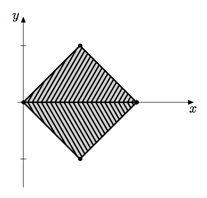
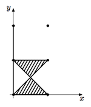
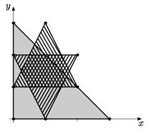
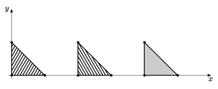

## 문제

Kalvin John Ian Helvik IV and Karl James Ingram Helvik III are second cousins and kings of neighbouring countries, Aastria and Abstria. One hundred years ago their countries constituted a single country, but the old king Helvik died and left his country to his twin sons, Ian and Ingram. Nobody knew what to do, until it was suggested to split the country into two equal parts. This was an overwhelmingly complex task, which the wisemen tried to cope with by calling the best minds from the future to solve.

Unfortunately, five attempts to solve the problem had failed, and the bloody civil war broke out. It lasted for seven years and ended with the NEERC (Northeastern Enormously Ragged Combat). As the Final Ordinance said, there would be two new countries in the place of the old one, one for Ian and one for Ingram. But these two countries had unequal areas, so it took only three years for war to start again.

After ninety years of war, all resources of two countries were exhausted. At the end of the year both kings had realized that they would not survive the next year if the war continued, so they simultaneously sent envoys with offers of peace. They had decided to unite their countries back and live in peace. The united land of Aastria and Abstria was named Aabstria.

In the manuscripts of the old ages you had found several descriptions of boundaries of the countries. Each description is a sequence of locations of boundary monuments, which are listed in clockwise or counterclockwise order following the boundary. However, you suddenly realized that in different sources locations of boundary monuments differ. In some of them, the boundary does not even form a polygon. You decided to do an investigation to discover what the actual boundaries of the countries were. Given locations of the boundary monuments for each of three countries the following statements should hold:

* For each country, the polyline formed by the boundary monuments should be a polygon. A polyline is considered to be a polygon if it has at least three points, no self-intersections, self-touches or holes, and has a non-zero area.
* The interiors of Aastria and Abstria polygons should not intersect.
* The union of Aastria and Abstria should be precisely equal to Aabstria.

Your task is to write a program that checks if these facts are true.

## 입력

The first line of the input file contains the number of vertices in the boundary of Aastria, na (1 ≤ na ≤ 10 000). The next na lines contain two integers each — the coordinates of Aastria boundary monuments in clockwise or counterclockwise order.

After that, descriptions of Abstria and Aabstria are given in the same format as above.

The coordinates of all monuments do not exceed 105 by their absolute values. It is guaranteed that two boundary monuments can coincide only if they belong to different countries.

## 출력

Output a single line with one the following strings (without quotes):

* if the boundary monuments of Aastria do not form a polygon, output “Aastria is not a polygon”;
* otherwise, if the boundary monuments of Abstria do not form a polygon, output “Abstria is not a polygon”;
* otherwise, if the boundary monuments of Aabstria do not form a polygon, output “Aabstria is not a polygon”;
* otherwise, if interiors of Aastria and Abstria intersect, output “Aastria and Abstria intersect”;
* otherwise, if the union of Aastria and Abstria is not equal to Aabstria, output “The union of Aastria and Abstria is not equal to Aabstria”;
* otherwise, output “OK”.

## 힌트

* 첫 번째 예제: 
* 두 번째 예제: 
* 세 번째 예제: 
* 네 번째 예제: 
