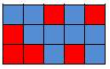

## 문제

Sam과 여동생 Sara는 n × m 테이블의 모든 셀을 빨간색과 파란색으로 색칠하고자 한다. 이들은 개인적인 믿음 때문에, 테이블의 모든 2 × 2 격자에는 빨간색 셀의 개수가 홀수(즉, 1 혹은 3)가 되기를 원한다. 예를 들어, 3 × 5 테이블에 이 조건을 만족하는 색칠의 예가 다음 그림에 있다.

불행히도, 지난 저녁에 누군가가 테이블의 어떤 셀들을 빨간색으로, 또 다른 어떤 셀들은 파란색으로 칠해놓았다. Sam과 Sara는 모든 2 × 2 격자에 빨간색 셀의 개수가 홀수가 되도록 테이블의 나머지를 색칠할 수 있는지를 알려고 한다. 만약 가능하다면, 모든 2 × 2 격자에 빨간색 셀의 개수가 홀수가 되도록 색칠할 수 있는 방법이 몇 개가 있는지를 알려고 한다.

## 입력

입력의 첫 번째 줄에 세 정수 n,m,k가 주어진다. 이들은 각각 테이블의 행의 수, 열의 수, 초기에 색칠되어진 셀의 수이다. 다음의 k 개 줄에 색칠된 셀들의 정보가 주어진다. 이들 k개 줄의 각 i번째 줄에는 세 정수 xi, yi, ci를 포함한다. xi, yi는 각각 초기에 i-번째 색칠된 셀의 행 번호, 열 번호이고, ci는 이 셀의 색이다. 이 셀이 빨간색으로 칠해져 있으면 ci는 1이고 파란색으로 칠해져 있으면 ci는 0이다. k개의 셀들의 위치는 모두 다르다.

2 ≤ n,m ≤ 105  
0 ≤ k ≤ 105  
1 ≤ xi ≤ n  
1 ≤ yi ≤ m

## 출력

테이블을 색칠할 수 있는 방법의 수를 W라 할 때, W modulo 109를 한 줄에 출력한다. (즉, W가 109보다 같거나 클 경우에는 W를 109으로 나눈 나머지를 출력한다.)
