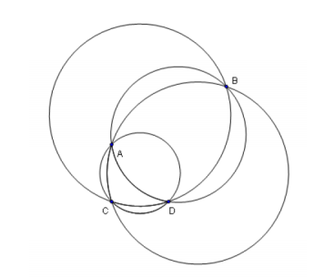

## 문제

어느 통신회사가 베이징에서 GSM(이동전화) 통신망을 개발하고 있다. 이 통신망은 도시에 있는 n개의 집에서 사용이 가능하도록 하려고 한다. 그러나 제한된 예산 때문에 이 회사는 단 하나의 안테나만 세울 수 있다.

안테나는 n개의 집들 중 3개를 선택하여, 이 집들로 만들어지는 원의 중심에 세운다. 이 경우, 이 원의 내부와 경계에 있는 모든 집들은 이 안테나로부터 신호를 받을 수 있다. 이 회사는 무작위로 세 곳의 집을 선택하려고 계획하고 있고 이때 신호를 받을 수 있는 집들의 수를 알기 위하여, 가능한 모든 세 집들에 대한 안테나 위치에 대해서 신호를 받을 수 있는 집들의 수의 평균을 구하고자 한다.

예를 들어, 아래의 그림과 같이 A,B,C,D 네 개의 집들이 있다고 하자.

위 그림에서 ABC 혹은 BCD의 집들을 선택하면, 이 경우의 안테나는 모든 집들에게 신호를 보낼 수 있다. 그러나 ACD 혹은 ABD를 선택하는 경우에는 하나의 집에서는 신호를 받지 못한다. 그러므로 신호를 받을 수 있는 집들의 수의 평균은 (4+4+3+3)/4 = 3.5이다.

여러분이 할 일은 집들의 위치가 주어질 때, 신호를 받을 수 있는 집들의 수의 평균을 구하는 것이다. 집들의 위치는 2차원 좌표계에서 정수좌표로 주어진다. 어떠한 세 집도 하나의 직선상에 존재하지 않으며, 어떠한 네 집도 하나의 원의 경계(원주)위에 존재하지 않는다.

## 입력

첫 번째 줄에 전체 집들의 수를 나타내는 하나의 양의 정수 n(3 ≤ n ≤ 1,500)이 주어진다. 그 다음의 n개의 각 줄에 집들의 위치가 주어진다. 1 ≤ i ≤ n에 대하여, 집 i의 위치 좌표를 나타내는 두 개의 정수 xi와 yi는 i+1번째 줄에 공백을 사이에 두고 주어진다

집 i의 좌표 (xi, yi)는 모두 정수로서 -1,000,000 ≤ xi,yi ≤ 1,000,000이다. 어떠한 세 집도 하나의 직선상에 존재하지 않으며, 어떠한 네 집도 하나의 원의 경계(원주)위에 존재하지 않는다.

## 출력

안테나의 신호가 도달 가능한 집들의 수의 평균을 하나의 실수로 출력한다. 출력결과의 오차 절댓값은 0.01보다 작거나 같아야한다.
