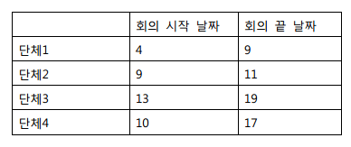

## 문제

시루세리 정부는 새로운 컨벤션 센터를 건설하였다. 여러 단체들이 회의를 개최하기 위해 이곳을 사용하기를 원한다. 한 단체가 컨벤션 센터를 사용하고 있는 경우, 그 단체가 사용하는 동안에는 다른 단체들이 컨벤션 센터를 사용할 수 없다. 컨벤션 센터의 책임자는 가능하면 가장 많은 단체들이 컨벤션 센터를 이용할 수 있도록 단체들을 선정하기를 원한다. 물론, 이러한 선정 방법에는 여러 가지가 있을 수 있다.

예를 들어 다음의 네 단체의 경우를 고려해보자. 네 단체는 다음의 표에 나타난 기간 동안 컨벤션 센터를 사용하고 싶어 한다

이 예에서는 최대 두 단체가 컨벤션 센터를 이용할 수 있다. 그 후보로는 (단체1, 단체3) 혹은 (단체2, 단체3) 혹은 (단체1, 단체4)이다. 단, 컨벤션 센터를 이용할 때에는 한 단체의 끝나는 날짜와또 다른 한 단체의 시작 날짜가 겹칠 수 없음을 주의하라. 그러므로 단체1과 단체2는 날짜 9가 서로 겹치므로 컨벤션 센터를 사용하기 위해 동시에 선정될 수 없다.

컨벤션 센터의 책임자는 위의 예와 같이 단체 선정방법이 여러 가지가 존재할 때 다음과 같은 규칙으로 컨벤션 센터를 사용할 단체를 선정한다. 각 단체들은 컨벤션 센터 사용을 신청한 순서대로 번호가 매겨지고, 선정 후보가 되는 단체는 단체 번호의 오름차순으로 주어진다. 이러한 후보 집합들 중에 사전편집상의 순서(lexicographical order)로 가장 처음 나타나는 집합이 선정된다.

위의 예에서는 세 후보 집합 {(1,3), (2,3), (1,4)}에 대해서 사전편집상의 순서가 (1,3) < (1,4) < (2,3) 이므로 가장 처음 나타나는 후보 (1,3), 즉 단체1과 단체3이 컨벤션 센터 사용가능 단체로 선정되게 된다.

여러분이 할 일은 이 책임자를 도와서 어떤 단체가 컨벤션 센터를 사용할 지를 정하는 것이다.

## 입력

입력의 첫 번째 줄에는 컨벤션 센터를 사용하기 원하는 단체의 수 N(N≤200,000)이 정수로 주어진다. 두 번째 줄부터 시작해서 N개의 줄에는 단체의 번호 순서대로 각 줄마다 두 개의 정수가 주어지는데 이는 컨벤션 센터를 사용하기 원하는 각 단체의 시작 날짜와 끝 날짜를 의미한다.

각 단체가 요구하는 회의 시작 날짜는 항상 1보다 크거나 같고, 회의 끝 날짜는 109을 초과하지 않는다.

## 출력

출력의 첫 번째 줄에는 컨벤션 센터를 사용할 수 있는 최대 단체의 수 M을 출력한다. 두 번째 줄에는 사전편집상의 순서로 가장 처음 나타나는 M개의 단체의 번호를 오름차순으로 출력한다

## 힌트

사전편집상의 순서(lexicographical order)에서 리스트 l1이 리스트 l2보다 작다는 것은 l1이 l2의 접두어(prefix)이거나 l1과 l2가 서로 다른 첫 번째 위치 j에서 l1[j] < l2[j]의 관계가 성립함을 의미한다.
