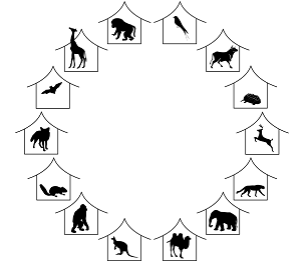
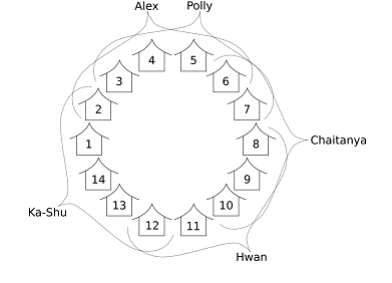

## 문제

아시아-태평양 지역의 자랑거리로 새로 지어진 원형동물원이 있다. 태평양의 작은 섬에 있는 이 동물원은 다음 그림과 같이 동물우리들이 큰 원형의 형태를 이루고 있으며, 이들 각 우리 안에는 고유의 동물 한 마리가 있다.

동물들을 관람하는 아이들에 대하여 가능하면 많은 아이들이 관람을 즐겁게 하도록 하는 일이 주어져 있다. 동물원을 관람하러 온 아이들을 즐겁게 하는 것은 쉬운 일이 아니다 - 어떤 아이들이 좋아하는 동물도 있고, 어떤 아이들이 무서워하는 동물도 있다.

예를 들어 Alex 는 원숭이와 코알라는 귀여워서 이들 동물을 좋아하지만, 사자는 날카로운 이빨 때문에 싫어한다. 반면에 Polly 는 아름다운 머리털 때문에 사자를 좋아하지만, 코알라는 아주 지독한 냄새 때문에 싫어한다.

아이들이 무서워하는 어떤 동물들을 다른 동물원으로 옮길 수 있는 선택권이 주어져 있다 하자. 너무 많은 동물을 옮기는 것이 좋지 않을 수 있다. 왜냐하면 아이들이 구경할 동물이 없을 수도 있기 때문이다. 가능하면 많은 아이들이 즐거워할 수 있도록 다른 동물원으로 옮길 동물들을 결정하고자 한다.

각 어린이는 동물원의 우리들이 이루는 원의 바깥쪽에 서 있으며, 자기 앞에 있는 연속하는 5 개의 우리에 있는 동물들만 구경한다. 각 어린이가 무서워하는 동물들과 좋아하는 동물들의 목록이 주어져 있다. 어린이는 다음을 만족하면 즐거워한다:

자기가 구경하는 동물들 중 자신이 무서워하는 동물이 한 마리 이상 옮겨지든지 혹은

자기가 구경하는 동물들 중 좋아하는 한 마리 이상의 동물이 남아 있다.

예를 들어, 어린이들이 좋아하는 동물들의 목록과 무서워하는 동물들의 목록이 아래와 같이 주어져 있다고 하자.

| 어린이 | 구경하는 우리 | 무서워하는 동물들 | 좋아하는 동물들 |
| --- | --- | --- | --- |
| Alex | 2, 3, 4, 5, 6 | 우리 4 | 우리 2, 6 |
| Polly | 3, 4, 5, 6, 7 | 우리 6 | 우리 4 |
| Chaitanya | 6, 7, 8, 9, 10 | 우리 9 | 우리 6, 8 |
| Hwan | 8, 9, 10 11, 12 | 우리 9 | 우리 12 |
| Ka-Shu | 12, 13, 14, 1, 2 | 우리 12, 13, 2 | - |

우리 4 와 12 에 있는 동물을 다른 동물원으로 옮긴다고 하자. 그러면 Alex 와 Ka-Shu 는 즐겁다. 왜냐하면, 이들 어린이는 자신이 무서워하는 한 마리 이상의 동물이 없어졌기 때문이다. 또, Chaitanya 는 자신이 좋아하는 우리 6 과 8 의 동물이 남아있기 때문에 즐겁다. 그러나 Polly 와 Hwan 은 자신들이 좋아하는 동물은 모두 옮겨져서 볼 수 없고 또한 무서워하는 동물들은 한 마리도 옮겨지지 않았기 때문에 즐겁지 않다. 그러므로 우리 4 와 12 에 있는 동물을 옮기면 즐거운 아이들은 총 3 명이 된다.

대신에 우리 4 와 6 의 동물을 다른 동물원으로 옮긴다고 하자. Alex 와 Polly 는 각각 자신이 무서워하는 한 마리 이상의 동물이 없어졌기 때문에 즐겁다. 그리고 Chaitanya 는 좋아하는 우리 6 의 동물이 없어졌지만 좋아하는 우리 8 의 동물을 볼 수 있기 때문에 즐겁다. 마찬가지로 Hwan 은 좋아하는 우리 12 의 동물을 볼 수 있으므로 즐겁다. Ka-Shu 만 즐겁지 않다.

다른 방법으로 우리 13 의 동물만 옮긴다고 하자. Ka-Shu 는 자신이 무서워하는 동물 하나가 없어졌기 때문에 즐겁다. 그리고 Alex 와 Polly, Chaitanya, Hwan 모두 자신이 좋아하는 동물이 한 마리 이상 남아 있어서 즐겁다. 이럴 경우 가장 많은 5 명의 어린이가 즐겁다.

## 입력

입력의 첫 번째 줄에 두 정수 N 과 C 가 나온다. N(10 ≤ N ≤ 10,000) 은 동물 우리의 개수이고 C(1 ≤ C ≤ 50,000)는 아이들 수이다. 동물 우리들은 원 주위에 시계방향으로 1, 2, ..., N 으로 번호가 붙여져 있다.

이어서 C 개의 줄이 주어지는데, 각 줄에는 각 어린이가 구경하는 우리들, 좋아하는 동물들, 싫어하는 동물들이 다음의 형태로 주어진다.

E F L X1 X2 … XF Y1 Y2 … YL

여기서:

E 는 이 어린이가 구경하는 첫 번째 우리의 번호이다 (1≤E≤N). 즉, 이 어린이가 구경하는 우리의 번호들은 E, E+1, E+2, E+3 과 E+4 이다. 우리의 번호가 N 보다 큰 경우, 처음으로 돌아간다. 만약 N = 14, E = 13 이면, 이 어린이가 구경하는 우리의 번호들은 13, 14, 1, 2, 3 이다.

F 는 이 어린이가 무서워하는 동물들의 수이고, L 은 좋아하는 동물들의 수이다.

X1,…,XF 는 이 어린이가 무서워하는 동물이 있는 우리의 번호들이다 (1 ≤ X1,…,XF ≤ N).

Y1,…,YL 은 이 어린이가 좋아하는 동물이 있는 우리의 번호들이다 (1 ≤ Y1,…,YL ≤ N).

X1,…,XF,Y1,…,YL 은 모두 다르고, 이들 모든 정수들은 이 아이가 구경하는 우리의 번호를 나타낸다.

어린이들은 첫 번째 우리번호를 나타내는 E 값에 따라 정렬된 순서로 나온다 (E 값이 가장 작은 어린이가 처음에 나오고, E 값이 가장 큰 어린이가 마지막에 나온다). E 값이 같은 어린이가 두 명 이상 있을 수 있음에 유의하라.

## 출력

동시에 즐거워할 수 있는 어린이의 최대수를 나타내는 정수 하나만 출력한다.
