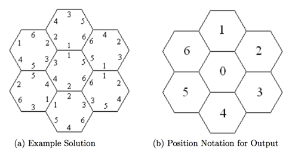

## 문제

A well known puzzle consists of 7 hexagonal pieces, each with the numbers 1 through 6 printed on the sides. Each piece has a different arrangement of the numbers on its sides, and the object is to place the 7 pieces in the arrangement shown below such that the numbers on each shared edge of the arrangement are identical. Figure (a) is an example of one solution:

Rotating any solution also gives another trivially identical solution. To avoid this redundancy, we will only deal with solutions which have a 1 on the uppermost edge of the central piece, as in the example.

## 입력

The first line of the input file will contain a single integer indicating the number of test cases. Each case will consist of a single line containing 42 integers. The first 6 represent the values on piece 0 listed in clockwise order; the second 6 represent the values on piece 1, and so on.

## 출력

For each test case, output the case number (using the format shown below) followed by either the phrase No solution or by a solution specification. A solution specification lists the piece numbers in the order shown in the Position Notation of Figure (b). Thus if piece 3 is in the center, a 3 is printed first; if piece 0 is at the top, 0 is printed second, and so on. Each test case is guaranteed to have at most one solution.
