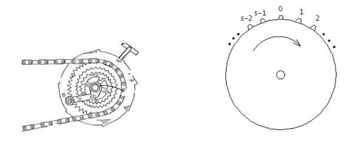

## 문제

Many of you have heard the story of Turing’s bicycle: Seems the sprocket on the crank of the bicycle had a broken prong. Also his chain had one link that was bent. When the bent link on the chain came to hook up with the broken prong, the chain would fall off and Turing would stop and put the chain back on. But Turing, being who he was, could predict just when this was going to happen — meaning he would know how many pedal strokes it would be — and so would hop off his bike just before it happened and gently move the pedals by hand as the undesired coupling passed. Then he’d be merrily (we imagine) on his way. (A picture of the sprocket-chain set up is shown below.)

Your job here is to calculate the number of revolutions required in such a situation as Turing’s: You’ll be given the number of prongs on the front sprocket, the number of links on the chain, the location of the broken prong and the location of the bent link in the chain. The top prong is at location 0, then the next one forward on the sprocket is location 1 and so on until prong numbered s − 1. (See the diagram. Notice that prong s − 1 is the next prong that moves to the top of the sprocket as Turing pedals.) Location of the links is similar: The link at the top of the sprocket is location 0 and so on forward until c − 1. The chain falls off when broken prong and bent link are both at location 0.



## 입력

Input for each test case will be one line of the form s c p l, where s is the number of prongs on the front sprocket (1 < s < 100) , c is the number of links in the chain (200 > c > s), p is the initial position of the broken prong, and l is the initial position of the bent link. The line 0 0 0 0 will follow the last line of input.

Broken prong and bent link will never both start at position 0.

## 출력

For each test case output a single one line as follows:

```

Case n: r m/s
```

if it requires r m/s revolutions to first fail, or

```

Case n: Never
```

if this can never happen.

Note that the denominator of the fraction will always be the number of prongs on the sprocket; the fraction will not necessarily be in lowest terms. Always print the values of r and m, even if 0.
