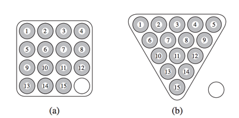

## 문제

선영이는 당구대를 상근이에게 빌렸다. 상근이는 선영이에게 공 16개가 들어갈 수 있는 4×4 크기의 트레이도 같이 주었다. 이 트레이는 그림 (a)와 같이 생겼다. 흰색 공은 큐 볼이고, 나머지 15개 공은 1부터 15까지 숫자가 적혀져 있다.

포켓볼을 시작하기 전에 숫자가 적혀져 있는 공은 삼각형 모양으로 빠짐없이 배치해야 한다. 이 배치는 그림 b에 나와있다.



선영이는 포켓볼과 비슷하지만, 큐 볼과 숫자가 적혀져 있는 x개 공을 가지고 하는 새로운 게임을 하나 창안했다. 이때, 공 x개를 삼각형 모양으로, x+1개를 m×m크기의 트레이에 넣을 수 있어야 한다. a와 b가 주어졌을 때, a보다 크고 b보다 작은 x+1 중에서 선영이가 만든 게임을 즐길 수 있는 x+1의 개수를 구하는 프로그램을 작성하시오. 공을 삼각형 모양을 만들고 ,트레이에 넣을 때, 모든 공을 사용해야 하고, 빈 칸 (삼각형, 사각형을 이루지 못하는 칸) 이 있으면 안 된다.

## 입력

입력은 여러 개의 테스트 케이스로 이루어져 있다. 각 테스트 케이스는 한 줄로 이루어져 있고, a와 b가 주어진다. (0 < a < b ≤ 109)

입력의 마지막 줄에는 0 0이 주어진다.

## 출력

각 테스트 케이스에 대해서, 다음을 출력한다.

```

case n: k
```

k는 a < x+1 < b인 x중에서 공 x개를 삼각형 모양으로 만들 수 있고, x+1개를 정사각형 트레이에 넣을 수 있는 x의 개수이다.
