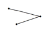

## 문제

As most of us know, the western Scandinavian coastline contains many small inlets from the sea known as fjords. Fjords have very steep sides, and make travel along the coast somewhat tedious (though breathtaking) as the roads must curve back and forth around them. The Fjord Accelerated Scandinavian Traffic Commission (FAST) has decided to solve this problem by putting in a series of bridges across the fjords to cut down on the distances which must be traveled. To save costs, FAST is using pre-constructed bridge units of length 1 meter each, but due to funding restrictions, the total length of bridge that they can build is limited. Therefore, they would like to determine the optimal locations to install bridges that would save the greatest length of road. Fjor example, if a bridge of length 10 meters is built that cuts off 30 meters of old road, a savings of 20 meters is realized. To simplify the determination of where to locate the bridges, FAST has decided to model each fjord as two line segments connecting three points as shown in the figure below.

All the angles making fjords are less than 180◦, of course. Furthermore, for safety reasons each bridge can span at most one fjord.

## 입력

Input for each test case will consist of two lines. The first line contains two positive integers n and m indicating the number of fjords and the maximum length (in meters) of bridge that can be built. The next line will contain 2n + 1 pairs of integer coordinates for the fjords, where the last coordinate for fjord i serves as the first coordinate for fjord i + 1. All coordinates are given in units of meters and will be between -300000 and 300000. The maximum values for n and m are 50 and 3000, respectively. Input will end with the line 0 0.

## 출력

For each test case output a single line containing the case number followed by the length of the bridge used and the total savings for the optimal placement of bridges, using the format shown below. All values should be in meters and round the latter number to the nearest hundredth.
