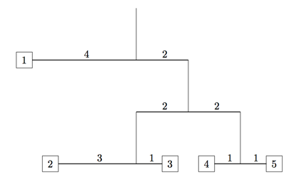

## 문제

You’ve probably seen mobiles suspended from the ceilings of museums or airports. We’ll restrict ourselves to the type suspended from the ceiling by a single wire that is attached to a pivot point on an arm (also made of wire). At each end of the arm is either another wire suspending yet another arm, or a weight (usually in the form of some design). Below is one example, made by Alexander Calder, the best-known mobile artist.

Some mobiles are simple and some are quite complex. Besides the artistry, these must balance. Recall that from a pivot point distance dL from the left and dR from the right, an arm will balance if the product of the weight at the left end and dL is equal to the product of the weight at the right end and dR. (We ignore the weight of the arm and the wires suspending the arms.)

For example, consider the mobile drawn below. If weight 1 weighs 8 units, then weights 2, 3, 4, and 5 must weigh 2, 6, 4, and 4 units respectively. In fact, if you know the structure of the mobile, that is, the arrangement of arms and where the pivot points are on each arm, and the value of one weight, you can determine the values of all the weights. That is your problem here – almost. It seems you only have weights that are integer valued. So, you’ll be given the desired minimum value of one weight and determine the value of the other weights, so that those values will also be integers. Thus, it’s possible that the specified minimum valued weight must be raised a little bit to accomplish this.



## 입력

Input for each test case will start with a line containing the positive integer n, indicating the number of arms in the mobile. These arms are numbered 1 through n. The next n lines will describe the arms, in order 1, 2, . . . , n, and will be in the form

```

dL dR typeL typeR nL nR
```

where dL and dR are integers ≤ 20 giving the distances from the pivot point to the left end and right end of the arm, typeL and typeR are each either W or A, indicating that a weight or arm hangs from the left or right ends, and nL and nR are the index numbers of the weight or arm on the left and right. The indices for the weights will start at 1 and be consecutive. The mobile will not have an arm that is hanging further down than 6 arms from the top. In our example above the lowest arm is 3 arms from the top.

Following the description of the arms is a line of the form m w, indicating that weight m weighs at least w, where 1 ≤ w ≤ 20.

A line containing a 0 follows the last test case

## 출력

For each test case output one line giving the minimum total weight of the mobile if weight m is at least w. Use the format given in the Sample Output. You may assume all output values will be less than 109.
