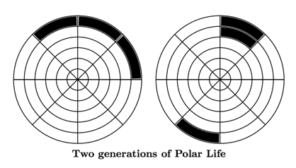
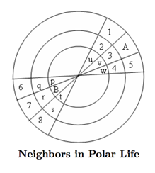

## 문제

“Hey, John, you know John Conway’s Game of Life?”

“You mean the one where you have a rectangular grid of cells, some alive, some dead, and cells all simultaneously update their status at regular clock ticks to form a new generation of cells, using the simple rules that a dead cell with exactly three live neighbors (the neighbors of a cell are the eight cells surrounding it) becomes live in the next generation, a live cell with fewer than 2 or more than 3 neighbors become dead in the next generation, and other cells’ status remain unchanged?”

“Yeah, that’s the one. I’ve been trying to program it ...”

“Big deal – everybody has done that!’

“Wait, let me finish – I’ve been trying to program it to work on polar coordinate graph paper, like this:”

“Hmmm. That looks like a real bear.”

“It’s not so bad – most of the cells have eight neighbors, just like Conway’s game. The only tricky ones are the ones on the outer circumference and the wedge-shaped cells in the center. But I think I’ve figured out what to do with them. If the number of radial lines is even, then every cell on the outer and inner rings has eight neighbors: the five ordinary neighbors on the ring and the nearest adjacent ring, plus the cell diametrically opposite on the grid, plus the left and right neighbors of that cell. For instance:”

“The neighbors of A are the cells numbered 1 through 8, and the neighbors of B are the cells labeled p through w.”

“What about an odd number of radial lines?”

“Don’t ask.”

## 입력

Input will consist of multiple problem instances. Each problem instance begins with two positive integers m and n, 3 ≤ m ≤ 100, 6 ≤ n ≤ 100, where m is the number of rings and n is the number of radii (in the first figure there are 6 rings and 8 radii). The value of n is always even. Following this is a positive integer k and a list of k distinct pairs of positive integers, which may extend over several lines. Each pair denotes the location of a live cell, where the first integer indicates a ring (counting from the outer ring inwards, starting at 0) and the second integer indicates the cell number in this ring (starting at 0 and going clockwise around the ring, beginning at some arbitrary but fixed radius line). This is followed by a nonnegative integer g ≤ 500, indicating the number of generations. The last test case is followed by two zeros.

## 출력

For each test case, print the test case number followed by five integers: the number of live cells after g iterations of the Game of Life rules; the location r1 c1 of the first live cell, and the location r2 c2 of the last live cell, where first and last are relative to the lexicographic ordering of ring and cell numbers of the live cells. If no cells have survived, the output should be 0 -1 -1 -1 -1.
