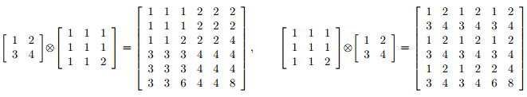

## 문제

두 행렬을 곱하는 또다른 방법이 있다. 이 방법은 텐서 곱이라고 한다.

A를 p × q 행렬, B를 n × m 행렬이라고 하자. 이때, A와 B는 1 × 1 행렬이 아니다.

A와 B의 텐서 곱 A ⊗ B는 pn × qm 행렬이 되고, A의 모든 원소 aij를 행렬 (aij) · B로 바꾼다.

아래는 행렬의 텐서 곱의 예시이다.

일반적인 행렬 곱과는 다르게, q와 n이 같아야 한다는 조건이 없다. 어떤 행렬이 주어졌을 때, 텐서 곱으로 이 행렬을 만들 수 있는 행렬의 가짓수를 구하는 프로그램을 작성하시오.

## 입력

입력은 여러 개의 테스트 케이스로 이루어져 있다. 각 테스트 케이스의 첫째 줄에는 행렬의 크기 r과 c가 주어진다. 다음 r개의 줄에는 행렬의 각 원소가 주어진다. r과 c는 500보다 작거나 같다. 또, 행렬의 각 원소는 65536보다 작거나 같다. 입력의 마지막 줄에는 0이 두 개 주어진다.

## 출력

각 테스트 케이스에 대해서, 텐서 곱으로 입력으로 주어진 행렬을 만들 수 있는 두 행렬의 서로 다른 방법의 수를 출력한다.
