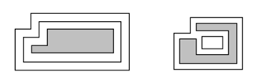
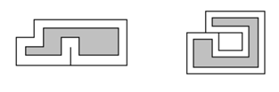

## 문제

Bob Roberts owns a design business which creates custom artwork for various corporations. One technique that his company likes to use is to take a simple rectilinear figure (a figure where all sides meet at 90 or 270 degrees and which contains no holes) and draw one or more rectilinear borders around them. Each of these borders is drawn so that it is a set distance d away from the previously drawn border (or the original figure if it is the first border) and then the new area outlined by each border is painted a unique color. Some examples are shown below (without the coloring of the borders).

The example on the left shows a simple rectilinear figure (grey) with two borders drawn around it. The one on the right is a more complicated figure; note that the border may become disconnected.

These pieces of art can get quite large, so Bob would like a program which can draw prototypes of the finished pieces in order to judge how aesthetically pleasing they are (and how much money they will cost to build). To simplify things, Bob never starts with a figure that results in a border where 2 horizontal (or vertical) sections intersect, even at a point. This disallows such cases as those shown below:

## 입력

Input will consist of multiple test cases. The first line of the input file will contain a single integer indicating the number of test cases. Each test case will consist of two or more lines. The first will contain three positive integers n, m and d indicating the number of sides of the rectlinear figure, the number of borders to draw, and the distance between each border, where n ≤ 100 and m ≤ 20. The remaining lines will contain the n vertices of the figure, each represented by two positive integers indicating the x and y coordinates. The vertices will be listed in clockwise order starting with the vertex with the largest y value and (among those vertices) the smallest x value.

## 출력

For each test case, output three lines: the first will list the case number (as shown in the examples), the second will contain m integers indicating the length of each border, and the third will contain m integers indicating the additional area contributed to the artwork by each border. Both of these sets of numbers should be listed in order, starting from the border nearest the original figure. Lines two and three should be indented two spaces and labeled as shown in the examples. Separate test cases with a blank line.
