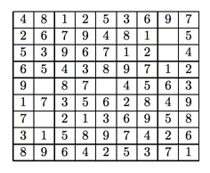

## 문제

바다에서 수학을 좋아하기로 유명한 오징어의 취미는 스도쿠이다. 스도쿠는 9\*9칸으로 이루어져 있으며, 3\*3칸에 1~9까지가 1번씩, 각각의 가로줄에도 1번씩, 세로줄에도 1번씩 들어가게 만드는 게임이다.

오징어는 하루를 스도쿠와 함께 시작한다. 스도쿠를 푸는 오징어가 멋있어 보였던 새우는 오징어에게 문제지를 하나만 달라고 요청하였고, 오징어는 문제지를 복사해 주었다.

새우는 오징어보다 스도쿠를 먼저 풀어서 자랑하기 위해 프로그래밍으로 스도쿠를 풀어보려고 한다.



위의 모습 처럼 생긴 스도쿠가 있다면, 숫자는 숫자로, 빈 칸은 0으로 주어진다.

스도쿠를 입력받아 스도쿠를 푸는 프로그램을 작성하시오

## 입력

입력의 첫째 줄에는 테스트 케이스의 개수가 주어진다. 각 테스트 케이스는 9개의 줄로 이루어진 스도쿠이다. 또, 각 줄은 0부터 9까지 숫자로 이루어져 있다. 각 테스트 케이스에는 항상 0이 5개가 주어진다.

## 출력

규칙을 지키면서 스도쿠를 풀 수 없는 경우에는

```

Could not complete this grid.
```

를 출력한다.

스도쿠를 풀 수 있는 경우에는 입력 형식대로 스도쿠를 9개 줄에 걸쳐서 출력한다.

각 테스트케이스 사이에는 빈 줄을 출력하며, 스도쿠를 풀 수 있는 경우에는 항상 정답이 유일한 것만 입력으로 주어진다.
