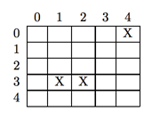
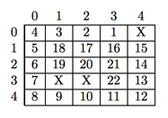

## 문제

Winston the Worm just woke up in a fresh rectangular patch of earth. The rectangular patch is divided into cells, and each cell contains either food or a rock. Winston wanders aimlessly for a while until he gets hungry; then he immediately eats the food in his cell, chooses one of the four directions (north, south, east, or west) and crawls in a straight line for as long as he can see food in the cell in front of him. If he sees a rock directly ahead of him, or sees a cell where he has already eaten the food, or sees an edge of the rectangular patch, he turns left or right and once again travels as far as he can in a straight line, eating food. He never revisits a cell. After some time he reaches a point where he can go no further so Winston stops, burps and takes a nap.

For instance, suppose Winston wakes up in the following patch of earth (X’s represent stones, all other cells contain food):



If Winston starts eating in row 0, column 3, he might pursue the following path (numbers represent order of visitation):



In this case, he chose his path very wisely: every piece of food got eaten. Your task is to help Winston determine where he should begin eating so that his path will visit as many food cells as possible.

## 입력

Input will consist of multiple test cases. Each test case begins with two positive integers, m and n, defining the number of rows and columns of the patch of earth. Rows and columns are numbered starting at 0, as in the figures above. Following these is a non-negative integer r indicating the number of rocks, followed by a list of 2r integers denoting the row and column number of each rock. The last test case is followed by a pair of zeros. This should not be processed. The value m × n will not exceed 625.

## 출력

For each test case, print the test case number (beginning with 1), followed by four values:

```

amount row column direction
```

where amount is the maximum number of pieces of food that Winston is able to eat, (row, column) is the starting location of a path that enables Winston to consume this much food, and direction is one of E, N, S, W, indicating the initial direction in which Winston starts to move along this path. If there is more than one starting location, choose the one that is lexicographically least in terms of row and column numbers. If there are optimal paths with the same starting location and different starting directions, choose the first valid one in the list E, N, S, W. Assume there is always at least one piece of food adjacent to Winston’s initial position.
