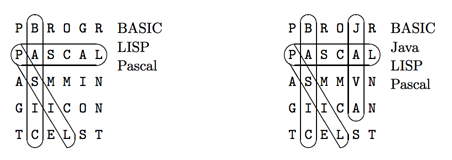

## 문제

Anna Graham is a puzzle maker who prides herself in the quality and complexity of her work. She makes puzzles of all kinds - crosswords, logic problems, acrostics, and word search puzzles, to name but a few. For each puzzle, she has developed a set of rules which she constrains herself to follow. For word search puzzles, she insists not only that all the words be connected to one another (as in most word search puzzles), but also that removing any word from the word list will not cause one or more words to become disconnected from the rest. (Two words are connected if they contain a common letter in the grid.) The example word search puzzle on the left satisfies this condition, but the one on the right does not (removing the word Pascal from the word list disconnects Java from the other two words).



Your job is to write a program that checks to see if Anna’s word search problems are up to snuff.

## 입력

Input will consist of multiple test cases. The first line of each test case contains 3 integers n m l, where n and m are the number of rows and columns in the puzzle and l is the number of words. Following this are n lines containing m uppercase characters each (the puzzle) followed by l lines containing one word each (the word list, in mixed case). Each word in the word list will appear in the puzzle exactly once. There will be no more than 100 rows and 100 columns in the puzzle and no more than 100 words to search for. There will be no spaces in the input words

## 출력

For each problem instance, output the word Yes or No depending on whether the puzzle satisfies Anna’s constraints.

## 힌트

Bonus Puzzle (For those of you with a little extra time.)

```

A D N E R H E B E T W E S T M I N S T E R T H
Y E G R A V E M E U D R U P O B E R L I N D E
E C M I C H I G A N W A T E R L O O I G I N T
L G E M R C U N T D I V E L L I V R A D E C A
L E U A H R W S E I E B T T Y S N T H R E S T
A R E I I I B N V Y O R K O S A A G A L N O S
V K G M N T O A I W H F T R G G G Z A E R I T
D A R D O M U D L E I H T O N I A D E R N B H
N R S O A Y E I O D O A T N N N K U D D B I G
A O L R N N N R G R W S I T N A Q E I S E O I
R A I R C G C E H G E I P O O W I A N N G N R
G H P O G I N H H N S I N F T V N T B H E A W
M S P R T U N S O G L R D W E A O N O T S G M
U A E N F D A C L R E I R U A L D I R F L I W
G E R O L B U E I V Y L H M E L I A O N C H D
N T Y I H O O Q T N A U L D G E L H Y H T C H
I E R H E T Y M U M N A O A A Y Y A I T E I B
K W O O S T E R N E W A H S N A F G C D O M R
S U C P I A T N A B S I T M C M A S T E R N O
U G K H O W L A U R E N T I A N O T E L R A C
M A S H L A N D Y T I C E V O R G L E J P B K
```

```

ALMA			DAYTON			MICHIGAN		SHERIDAN
AKRON			DUQUESNE		MT VERNON NAZARENE	SLIPPERY ROCK
ALLEGHENY		EDINBORO		MUSKINGUM		SPRING ARBOR
ASHLAND 		E(astern) MICHIGAN	N(orthern) MICHIGAN	THIEL
BALDWIN-WALLACE		FANSHAWE		NOTRE DAME		TOLEDO
BEHREND			GRAND VALLEY		OBERLIN			TORONTO
BOWLING GREEN		GROVE CITY		OHIO N(orthern)		WATERLOO
BROCK			HIRAM			OHIO WESLEYAN		WESTMINSTER
CARLETON		IIT			OLIVET			WILFRID LAURIER
CEDARVILLE		INDIANA			OTTAWA			WINDSOR
CINCINNATI		LAURENTIAN		PITT			WOOSTER
C(entral) MICHIGAN	MARIETTA		PURDUE			WRIGHT STATE
CMU			MCMASTER		QUEENS			YORK
CONESTOGA		MIAMI			SAGINAW VALLEY
```
