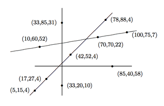

## 문제

There are many forms of contests where the contestants (shooters) try to hit targets, either moving or still. In this version there are a number of small balloons sitting on the tops of poles that are in turn stuck in the ground at various points in a large field. These poles are not all the same height. The shooter circles the field and fires at the balloons, the goal being to burst all the balloons with as few shots as possible. Since the balloons offer almost no resistance to a bullet, the bullet will pass right through and possibly hit one or more other balloons. So, by judiciously taking shots, the shooter might need only a very few shots to hit all the targets (provided the shooter is a good marksman, which we will assume is the case).

For example, the following field of 10 targets can be covered in only four shots, as shown. (The first two numbers at each position indicate the position of the balloon, and the third number the height.)

Your job is to determine the fewest number of shots necessary to hit all the targets in a given field.

## 입력

There will be multiple test cases. Each test case will consist of an integer n (≤ 50) indicating the number of target positions to follow. A value of n = 0 indicates end of input. There will follow n integer triples, x y h, indicating a balloon at position (x,y) in the field at height h. (There will be at most one balloon at any position (x,y).) All integers are greater than 0 and no greater than 100. Furthermore assume that the shooter can take shots from anywhere on the field at any height. For simplification, assume here that the balloons are points and that the bullets can pass through the poles on which the balloons are perched.

## 출력

Each test case should produce one line of output of the form:

Target set k can be cleared using only s shots.

where k is the number of the test case, starting at 1, and the value of s is the minimum number of shots needed to hit all the targets in the set.
