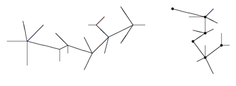

## 문제

An undirected graph is called a caterpillar if it is connected, has no cycles, and there is a path in the graph where every node is either on this path or a neighbor of a node on the path. This path is called the spine of the caterpillar and the spine may not be unique. You are simply going to check graphs to see if they are caterpillars.

For example, the left graph below is not a caterpillar, but the right graph is. One possible spine is shown by dots.



## 입력

There will be multiple test cases. Each test case starts with a line containing n indicating the number of nodes, numbered 1 through n (a value of n = 0 indicates end-of-input). The next line will contain an integer e indicating the number of edges. Starting on the following line will be e pairs n1 n2 indicating an undirected edge between nodes n1 and n2. This information may span multiple lines. You may assume that n ≤ 100 and e ≤ 300. Do not assume that the graphs in the test cases are connected or acyclic.

## 출력

For each test case generate one line of output. This line should either be

```

Graph g is a caterpillar.
```

or

```

Graph g is not a caterpillar.
```

as appropriate, where g is the number of the graph, starting at 1.
