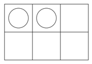
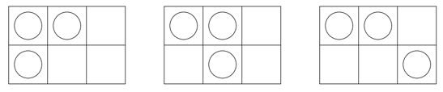

## 문제

Almost anyone who has ever taken a class in computer science is familiar with the “Game of Life,” John Conway’s cellular automata with extremely simple rules of birth, survival, and death that can give rise to astonishing complexity.

The game is played on a rectangular field of cells, each of which has eight neighbors (adjacent cells). A cell is either occupied or not. The rules for deriving a generation from the previous one are:

* If an occupied cell has 0, 1, 4, 5, 6, 7, or 8 occupied neighbors, the organism dies (0, 1: of loneliness; 4 thru 8: of overcrowding).
* If an occupied cell has two or three occupied neighbors, the organism survives to the next generation.
* If an unoccupied cell has three occupied neighbors, it becomes occupied (a birth occurs).

One of the major problems researchers have looked at over the years is the existence of so-called “Garden of Eden” configurations in the Game of Life — configurations that could not have arisen as the result of the application of the rules to some previous configuration. We’re going to extend this question, which we’ll call the “Game of Efil”: Given a starting configuration, how many possible parent configurations could it have? To make matters easier, we assume a finite grid in which edge and corner cells “wrap around” (i.e., a toroidal surface). For instance, the 2 by 3 configuration:



has exactly three possible parent configurations; they are:



You should note that when counting neighbors of a cell, another cell may be counted as a neighbor more than once, if it touches the given cell on more than one side due to the wrap around. This is the case for the configurations above.

## 입력

There will be multiple test cases. Each case will start with a line containing a pair of positive integers m and n, indicating the number of rows and columns of the configuration, respectively. The next line will contain a nonnegative integer k indicating the number of “live” cells in the configuration. The following k lines each contain the row and column number of one live cell, where row and column numbering both start at zero. The final test case is followed by a line where m = n = 0 — this line should not be processed. You may assume that the product of m and n is no more than 16.

## 출력

For each test case you should print one line of output containing the case number and the number of possible ancestors. Imitate the sample output below. Note that if there are 0 ancestors, you should print out

```

Garden of Eden.
```
