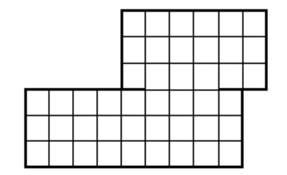

## 문제

Little Bobby Roberts, age 8, has been dragged to yet another museum by his parents. While they while away the hours studying Etruscan pottery and Warhol soup cans, Bobby must depend on himself for entertainment. Having a mathematical bent, he recently started counting all the square tiles on the floors of the museum. He soon realized that the tiles could be grouped into larger squares that needed to be added to the count. The problem became a bit more complicated when he started counting squares contained in multiple rooms, since some squares overlapped both rooms. For example, the two rooms shown below contain a total of 86 squares: 45 1 × 1 squares, 28 2 × 2 squares and 13 3 × 3 squares. (Note the opening between the two rooms is only 3 squares wide.)



While this helped kill several days’ worth of museum visits, it soon became rather tedious, so Bobby is now looking for a program to automate the counting process for him.

## 입력

Input will consist of multiple test cases. The first line of each case will be a positive integer n ≤ 1000 which will indicate the number of rooms in the museum. After this will be n lines, each containing a description of one room. Each room will be rectangular in shape and will be described by a line of the form

```

x1 y1 x2 y2
```

where (x1,y1) and (x2,y2) are opposing corner coordinates (integers) of the room. No two rooms will overlap, though they may share a side. If the shared side is of length m > 2, then a door of length m−2 exists between the two rooms, centered along the shared length. No square of any size will overlap more than two rooms. All x and y values will be ≤ 1, 000, 000. An input line of n = 0 terminates input and should not be processed.

## 출력

For each test case, output the total number of squares on a single line in the format shown below. All answers will fit within a 32-bit integer and cases are enumerated starting at 1.
