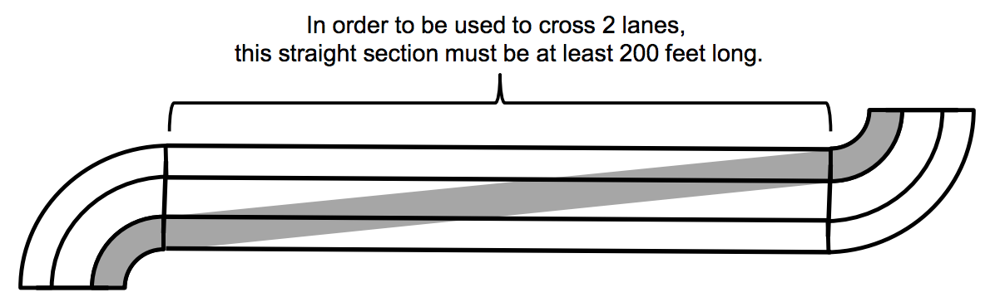

## 문제

After wracking your brains at a programing contest on Saturday, you’d like to relax by taking a leisurely Sunday drive. But, gasoline is so expensive nowadays! Maybe, by creatively changing lanes, you can minimize the distance you travel and save some money!

You will be given a description of several sections of a highway. All sections will have the same number of lanes. Think of your car as a point mass, moving down the center of the lane. Each lane will be 10 feet wide. There are two kinds of highway sections: curved and straight. You can only change lanes on straight sections, and it takes a minimum of 100 feet of the straight section to move over one lane. You can take longer than that, of course, if you choose.

All curve sections will make 90 degree turns. You cannot change lanes on a curve section. In addition, you must be driving along the exact middle of a lane during a turn. So during a turn your position will be 5 feet, or 15 feet, or 25 feet from the edge, etc.

Given a description of a highway, compute the minimum total distance required travel the entire highway, including curves and lane changes. You can start, and end, in any lane you choose. Assume that your car is a point mass in the center of the lane. The highway may cross over/under itself, but the changes in elevation are miniscule, so you shouldn’t worry about their impact on your distance traveled.



## 입력

There will be several test cases in the input. Each test case will begin with two integers

```

N M
```

Where N (1 ≤ N ≤ 1,000) is the number of segments, and M (2 ≤ M ≤ 10) is the number of lanes.

On each of the next N lines will be a description of a segment, consisting of a letter and a number, with a single space between them:

```
T K
```

The letter T is one of S, L, or R (always capital). This indicates the type of the section: a straight section (S), a left curve (L) or a right curve (R). If the section is a straight section, then the number K (10 ≤ K ≤ 10,000) is simply its length, in feet. If the section is a right or left curve, then the number K (10 ≤ K ≤ 10,000) is the radius of the inside edge of the highway, again in feet. There will never be consecutive straight sections in the input, but multiple consecutive turns are possible. The input will end with a line with two 0s.

## 출력

For each test case, print a single number on its own line, indicating the minimum distance (in feet) required to drive the entire highway. The number should be printed with exactly two decimal places, rounded. Output no extra spaces, and do not separate answers with blank lines.
