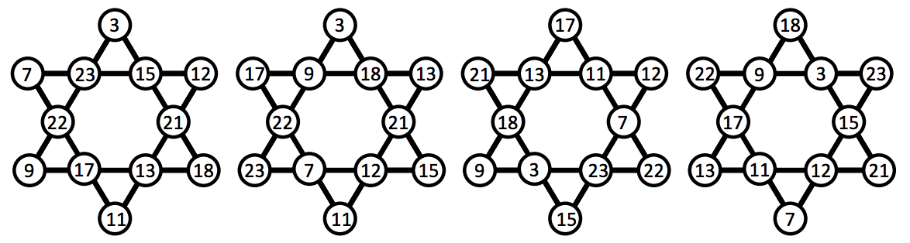

## 문제

A Hexagram is a 6-pointed star, sometimes called the Star of David. Given these numbers:

```

3 17 15 18 11 22 12 23 21 7 9 13
```

There are four unique ways of assigning the numbers to vertices of the hexagram such that all of the sets of four numbers along the lines have the same sum (57 in this case). All other ways may be obtained from these by rotation and/or reflection.



Given 12 distinct numbers, in how many ways, disregarding rotations and reflections, can you assign the numbers to the vertices such that the sum of the numbers along each of 6 straight lines passing through 4 vertices is the same?

## 입력

There will be several test cases in the input. Each test case will consist of twelve unique positive integers on a single line, with single spaces separating them. All of the numbers will be less than 1,000,000. The input will end with a line with twelve 0s.

## 출력

For each test case, output the number of ways the numbers can be assigned to vertices such that the sum along each line of the hexagram is the same. Put each answer on its own line. Output no extra spaces, and do not separate answers with blank lines.
