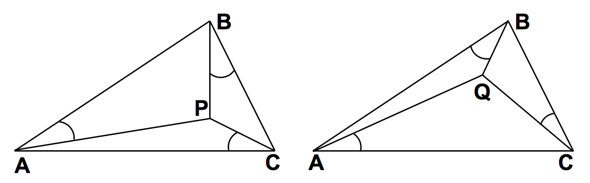

## 문제

The All-Equal company has been tasked with placing towers on triangular plots so that the angles formed between the towers and the sides of the plots are equal. Given a triangle defined by points A, B and C, there are two such points - call them P and Q. There is one where angles PAB = PBC = PCA, and one where angles QBA = QCB = QAC.



## 입력

There will be several test cases in the input. Each test case will consist of six integers on a single line:

```

AX AY BX BY CX CY
```

Each integer will be in the range from -100 to 100. These integers represent the three points of the triangle: (AX,AY), (BX,BY) and (CX,CY). The points are guaranteed to form a triangle: they will be distinct, and will not all lie on the same line. The input will end with a line with six 0s.

## 출력

For each test case, output four space-separated real numbers:

```

PX PY QX QY
```

Where (PX,PY) and (QX,QY) are the requested points. Print each real number with exactly two decimal places, rounded, and put a single space between them. Print no blank lines between outputs.
