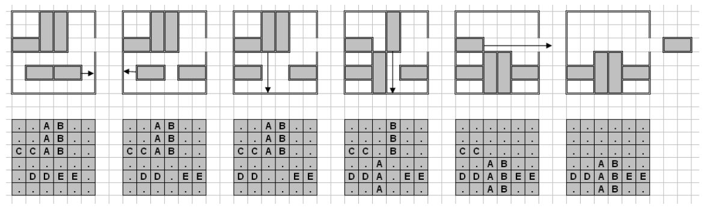

## 문제

Bud bought a new board game. He is hooked. He has been playing it over and over again, and he thinks can solve any board with the minimum number of moves, but he is uncertain. He wants you to write a program to calculate the minimum number of moves required to solve different boards, so that he can double check his answers.

You are given a 6x6 board, and a set of 2x1 or 3x1 (vertical) or 1x2 or 1x3 (horizontal) pieces. You can slide the horizontal pieces horizontally only, and the vertical pieces vertically only. You may slide a piece if there are no other pieces, nor walls, obstructing its path.

There will be one special 1x2 horizontal piece. There will also be a gap in the wall, on the right side, on the same row as the special piece, that only the special piece can fit through.The goal of the game is to get that one special horizontal piece out of the gap on the right side.

Sliding a piece any number of squares is considered one move. (i.e. sliding a piece horizontally one square is one move, and sliding it two squares at once is also considered one move).

## 입력

There will be several test cases. Each test case will begin with a line with a single capital letter, indicating the special piece which must be moved off of the board. The next 6 lines will consist of 6 characters each. These characters will either be a "." (period), indicating an empty square, or a capital letter, indicating part of a piece. The letters are guaranteed to form pieces that are 1x2, 1x3, 2x1 or 3x1, and no letter will be used to represent more than one piece on any given board. The letter indicating the special piece is guaranteed to correspond to a 1x2 piece somewhere on the board. The end of data is indicated by a single "\*" (asterisk) on its own line.

## 출력

For each test case, print a single integer, indicating the smallest number of moves necessary to remove the given special piece, or -1 if it isn‟t possible. Print each integer on its own line. There should be no blank lines between answers.
