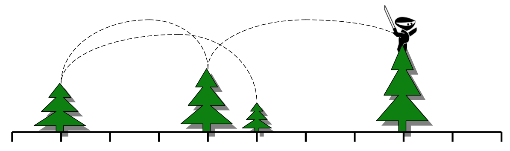

## 문제

As we all know, Ninjas travel by jumping from treetop to treetop. A clan of Ninjas plans to use N trees to hone their tree hopping skills. They will start at the shortest tree and make N-1 jumps, with each jump taking them to a taller tree than the one they‟re jumping from. When finished, they will have been on every tree exactly once, traversing them in increasing order of height, and ending up on the tallest tree.

The ninjas can travel for at most a certain horizontal distance D in a single jump. To make this as much fun as possible, the Ninjas want to maximize the distance between the positions of the shortest tree and the tallest tree.

The ninjas are going to plant the trees subject to the following constraints.

* All trees are to be planted along a one-dimensional path.
* Trees must be planted at integer locations along the path, with no two trees at the same location.
* Trees must be arranged so their planted ordering from left to right is the same as their ordering in the input. They must NOT be sorted by height, or reordered in any way. They must be kept in their stated order.
* The Ninjas can only jump so far, so every tree must be planted close enough to the next taller tree. Specifically, they must be no further than D apart on the ground (the difference in their heights doesn‟t matter).

Given N trees, in a specified order, each with a distinct integer height, help the ninjas figure out the maximum possible distance they can put between the shortest tree and the tallest tree, and be able to use the trees for training.

## 입력

There will be multiple test cases. Each test case begins with a line containing two integers N (1 ≤ N ≤ 1000) and D (1 ≤ D ≤106). The next N lines each contain a single integer, giving the heights of the N trees, in the order that they should be planted. Within a test case, all heights will be unique. The last test case is followed by a line with two 0's.

## 출력

For each test case, output a line with a single integer representing the maximum distance between the shortest and tallest tree, subject to the constraints above, or -1 if it is impossible to lay out the trees. Do not print any blank lines between answers.
