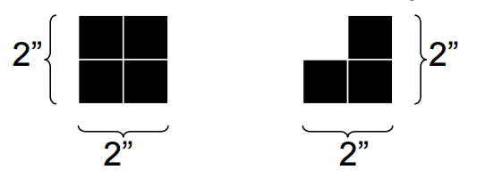
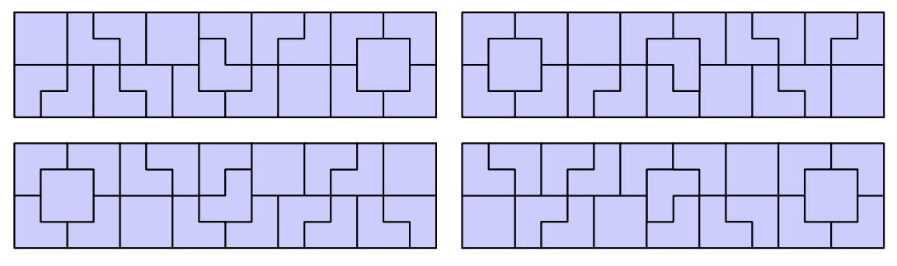

## 문제

An architect wants to decorate one of his buildings with a long, thin mosaic. He has two kinds of tiles available to him, each 2 inches by 2 inches:

He can rotate the second kind of tile in any of four ways. He wants to fill the entire space with tiles, leaving no untiled gaps. Now, he wonders how many different patterns he can form. He considers two mosaics to be the same only if they have exactly the same kinds of tiles in exactly the same positions. So, if a rotation or a reflection of a pattern has tiles in different places than the original, he considers it a different pattern. The following are examples of 4” x 16” mosaics, and even though they are all rotations or reflections of each other, the architect considers them to be four different mosaics:

## 입력

There will be several test cases. Each test case will consist of two integers on a single line, N and M (2 ≤ N ≤ 10, 2 ≤ M ≤ 500). These represent the dimensions of the strip he wishes to fill, in inches. The data set will conclude with a line with two 0's.

## 출력

For each test case, print out a single integer representing the number of unique ways that the architect can tile the space, modulo 106. Print each integer on its own line, with no extra whitespace. Do not print any blank lines between answers.
