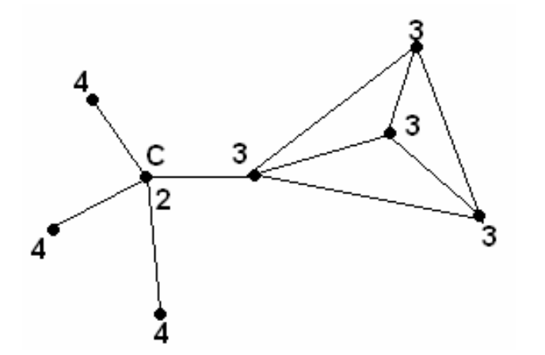

## 문제

The nation of Graphia is at war. The neighboring nations have for long watched in jealousy as Graphia erected prosperous cities and connected them with a network of highways. Now they want a piece of the pie.

Graphia consists of several cities, connected by highways. Graphian terrain is rough, so the only way to move between the cities is along the highways. Each city has a certain number of troops quartered there. Graphia’s military command knows that it will require a certain number of troops, K, to defend any city. They can defend a city with the troops stationed there, supported by the troops in any other city which is directly connected with a highway, with no cities in between. Any troops further away than that simply cannot get there in time. They also know that their enemies will onlyattack one city at a time – so the troops in a city can be used to defend that city, as well as any of its neighbors. However, if a city can’t be defended, then the military command must assume that the troops quartered in that city will be captured, and cannot aid in the defense of Graphia. In the case below, suppose K=10. City C might seem well defended, but it will eventually fall.

Graphia's leadership wants to identify the Heart of their country – the largest possible group of cities that can mutually defend each other, even if all of the other cities fall.

More formally, a city is defensible if it can draw a total of at least K troops from itself, and from cities directly adjacent to it. A set of cities is defensible if every city in it is defensible, using only troops from itself and adjacent cities in that set. The Heart of the country is the largest possible defensible set of cities - that is, no other defensible set of cities has more cities in it.

## 입력

There will be several data sets. Each set begins with two integers, N and K, where N is the number of cities (3 <= N <= 1000), and K is the number of troops required to defend a city. The cities are numbered 0 through N-1.

On the next N lines are descriptions of the cities, starting with city 0. Each of the city description lines begins with an integer T, indicating the number of troops quartered in that city (0 <= T <= 10000). This is followed by an integer M, indicating the number of highways going out of that city, and then M integers, indicating the cities those highways go to. No two highways will go from and to the same cities, so every city in each list will be unique. No highway will loop from a city back to the same city. The highways go both ways, so that if city I is in city J’s list, then it’s guaranteed that city J will be in city I’s list in the input. The input will end with a line with two space-separated 0’s.

## 출력

For each data set, print two integers on a single line: The number of cities in the heart of the country, and the number of troops in the heart of the country. Print a space between the integers. There should be no blank lines between outputs.
