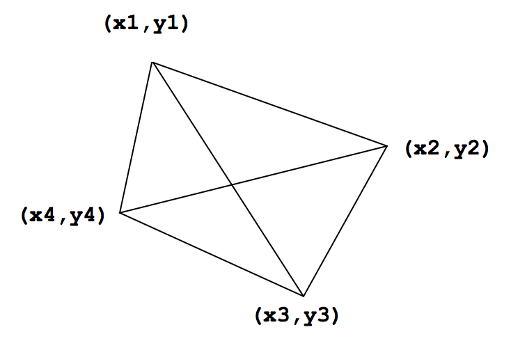
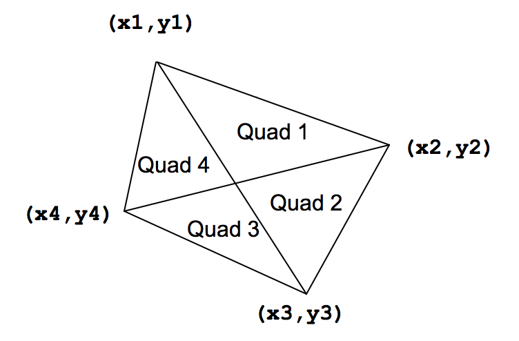

## 문제

The tiny country of Waterlogged is protected by a series of levees that form a quadrilateral as shown below:



The quadrilateral is defined by four vertices. The levees partition the country into four quadrants. Each quadrant is identified by a pair of vertices representing the outside edge of that quadrant. For example, Quadrant 1 shown below is defined by the points (x1,y1) and (x2,y2).



It happens very often that the country of Waterlogged becomes flooded, and the levees need to be reinforced, but their country is poor and they have limited resources. They would like to be able to reinforce those levees that encompass the largest area first, then the next largest second, then the next largest third, and the smallest area fourth.

Help Waterlogged identify which quadrants are the largest, and the length of the levees around them

## 입력

There will be several sets of input. Each set will consist of eight real numbers, on a single line. Those numbers will represent, in order:

```

X1 Y1 X2 Y2 X3 Y3 X4 Y4
```

The four points are guaranteed to form a convex quadrilateral when taken in order – that is, there will be no concavities, and no lines crossing. Every number will be in the range from -1000.0 to 1000.0 inclusive. No Quadrant will have an area or a perimeter smaller than 0.001. End of the input will be a line with eight 0.0’s.

## 출력

For each input set, print a single line with eight floating point numbers. These represent the areas and perimeters of the four Quadrants, like this:

```
A1 P1 A2 P2 A3 P3 A4 P4
```

Print them in order from largest area to smallest – so A1 is the largest area. If two Quadrants have the same area when rounded to 3 decimal places, output the one with the largest perimeter first. Print all values with 3 decimal places of precision (rounded). Print spaces between numbers. Do not print any blank lines between outputs.
