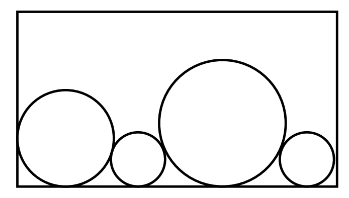

## 문제

Ian's going to California, and he has to pack his things, including his collection of circles. Given a set of circles, your program must find the smallest rectangular box in whih they fit.

All circles must touch the bottom of the box. The figure below shows an acceptable packing for a set of circles (although this may not be the optimal packing for these particular circles). Note that in an ideal paking, each circle should touch at least one other circle (but you probably figured that out).

## 입력

The first line of input contains a single positive decimal integer n, n ≤ 100. This indicates the number of lines which follow. The subsequent n lines each contain a series of numbers separated by spaces. The first number on each fo these lines is a positive integer m, m ≤ 8, which indicates how many other numbers appear on that line. The next m numbers on the line are the radii of the circles which must be packed in a single box. These numbers need not be integers.

## 출력

For each data line of input, excluding the first line of input containing n, your program must output the size of the smallest rectangle which can pack the circles. Each case should be output on a separate line by itself, with three places after the decimal point. Do not output leading zeroes unless the number is less than 1, e.g. 0.543.
