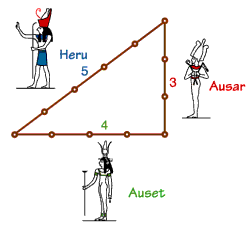

## 문제

 과거 이집트인들은 각 변들의 길이가 3, 4, 5인 삼각형이 직각 삼각형인것을 알아냈다. 주어진 세변의 길이로 삼각형이 직각인지 아닌지 구분하시오.

## 입력

입력은 여러개의 테스트케이스로 주어지며 마지막줄에는 0 0 0이 입력된다. 각 테스트케이스는 모두 30,000보다 작은 양의 정수로 주어지며, 각 입력은 변의 길이를 의미한다.

## 출력

각 입력에 대해 직각 삼각형이 맞다면 "right", 아니라면 "wrong"을 출력한다.
