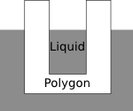

## 문제

A polygon is lowered at a constant speed of v metres per minute from the air into a liquid that dissolves it at a constant speed of c metres per minute from all sides. Given a point (x,y) inside the polygon that moves with the polygon, determine when the liquid reaches the point.

The border between air and liquid always has y-coordinate 0, and the liquid only eats away from the sides of the polygon in 2 dimensions. The polygon does not rotate as it is lowered into the liquid, and at time 0, it is not touching the liquid.

Unlike the polygon, which is flat (2-dimensional), the liquid exists in three dimensions. Therefore, the liquid seeps into cavities in the polygon. For example, if the polygon is "cup-shaped", the liquid can get "inside" the cup, as in the diagram below.

## 입력

The input consists of several test cases.

The first line of each test case contains the five integers N, x, y, v, and c, where 3 <= N <= 30, -100 <= x <= 100, 1 <= y <= 100, and 1 <= c < v <= 10.

The following N lines of the test case each contain one vertex of the polygon. The ith line contains the two integers x, y, where -100 <= x <= 100, 1 <= y <= 100.

The vertices of the polygon are given in counter-clockwise order. The border of the polygon does not intersect or touch itself, and the point (x,y) lies strictly inside the polygon—it does not lie on the border of the polygon.

Input is terminated by a line containing 0 0 0 0 0. These zeros are not a test case and should not be processed.

## 출력

For each test case, output the first time in minutes that the liquid reaches the specified point, rounded to four decimal places.
