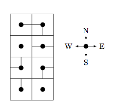

## 문제

After solving a difficult programming problem, you decide to take a break and play a puzzle game. After playing the game for a while, you decide to write a program to solve it for you.

The game is played on a grid with R rows and C columns. Each square of the grid contains a black dot in the centre and black lines in the direction of some, none, or all of its north, east, south, and west neighbouring squares. Your objective in this game is to move your playing piece from the centre of the square in the i1th row and the j1th column, where it begins, to the centre of the square in the the i2th row and the j2th column.

You wish to do this in the least number of turns possible, where a turn consists of the following two parts. First in each turn, you may opt to select any grid square and rotate it 90 degrees clockwise or counterclockwise. Second in each turn, you may opt to move your piece from the centre of its current grid square to the centre of a neighbouring grid square, provided your piece does not leave the black markings. In other words, you may move from a square A to a neighbouring square B if A has a black line in the direction of B and B has a black line in the direction of A. Note that either part of a turn may be omitted.

## 입력

Input consists of a number of test cases. The first line of each test case contains the two integers R and C, separated by spaces, with 1 <= R, C <= 20.

The next line contains the integers i1, j1, i2, j2, separated by spaces, with 1 <= i1, i2 <= R and 1 <= j1, j2 <= C.

The following R lines of input each contain one row of the grid, from north to south. Each of these lines contains exactly C strings of letters, separated by spaces, that correspond to squares of the grid, from west to east. Their format is as follows:

* If the string is the single character x, then the square does not contain a line to any of its neighbours.
* Otherwise, the string contains some of the characters N, E, S, W, which indicate that a black line extends from this square's centre in the direction of its north, east, south, or west neighbour, respectively. No character will appear in the string more than once.

It is guaranteed that it is possible to move your playing piece from (i1, j1) to (i2, j2).

Input is terminated by a line containing 0 0. These zeros are not a test case and should not be processed.

## 출력

Output consists of exactly one line for each test case. The lines contains an integer: the minimum number of turns to move your playing piece from (i1, j1) to (i2, j2).

## 힌트

A diagram of the input:

An example optimal solution is:

1. Rotate (2,2) clockwise. Step to (1,2).
2. Rotate (3,2) counterclockwise. Step to (2,2).
3. Rotate (3,2) counterclockwise. Step to (3,2).
4. Rotate (3,1) clockwise. Step to (3,1).
5. Rotate (3,1) clockwise. Step to (4,1).
