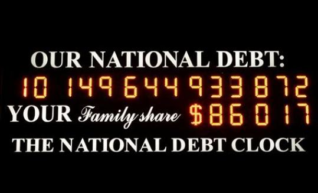

## 문제

A googol written out in decimal has 101 digits. A googolplex has one plus a googol digits. That's a lot of digits!

Given any number x0, define a sequence using the following recurrence:

> xi+1 = the number of digits in the decimal representation of xi

Your task is to determine the smallest positive i such that xi = xi-1.

## 입력

Input consists of several lines. Each line contains a value of x0. Every value of x0 is non-negative and has no more than one million digits. The last line of input contains the word END.

## 출력

For each value of x0 given in the input, output one line containing the smallest positive i such that xi = xi-1.
