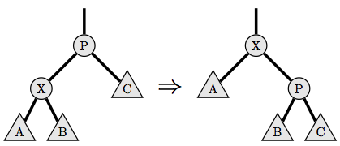
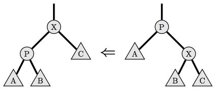

## 문제

Rotate-to-root is a heuristic for balancing binary search trees. In this problem, the contents of the tree will be ignored, and you will be asked about the effect the heuristic has on the structure of the tree.

A binary tree is either empty or consists of a node with a left child and a right child, where each of the children are also binary trees. No node has more than one parent, and there are no cycles. In any non-empty tree, there is exactly one node without a parent, which is called the root of the tree.

The rotate-to-root heuristic takes effect when a node in the tree, say X, is accessed. While X is not the root of the tree, the following procedure is executed:

* If X is the left child of its parent, a right tree rotation is performed. Let P be the parent of X, let A be X's left child, let B be X's right child, and let C be the right child of P. Then, P is replaced in the tree by X, so P's parent (if any) becomes X's parent; X's right child becomes P's left child (which replaces X); and P replaces X's right child. Diagram:  
  
* If X is the right child of its parent, a left tree rotation is performed. Let P be the parent of X, let A be the left child of P, let be B be X's left child, and let C be X's right child. Then, P is replaced in the tree by X, so P's parent (if any) becomes X's parent; X's left child becomes P's right child (which replaces X); and P replaces X's left child. Diagram:  
  

Tree rotations preserve the order of the nodes in the tree, which is why they are useful, but that is not important for this problem.

The height of a binary tree is the longest length of a path from its root to the bottom of the tree. More formally, the height of the empty tree is 0, and the height of a non-empty tree that has a root node X with children A and B is 1 + max{height(A), height(B)}.

Given a binary tree, you must determine, for each node X, what the height of the tree would be after X is rotated to root.

## 입력

Input consists of a number of test cases. The first line of each test case contains the integer N, the number of nodes in the binary tree, where 1 <= N <= 105.

The following N lines of input each contain two integers. The ith pair of these integers is li and ri, the left and right children of node i. If li = 0, then the left child of node i is the empty tree, and if ri = 0, then the right child of node i is the empty tree. Otherwise, 1 <= l, r <= N.

It is guaranteed that the input will describe a binary tree.

The last test case is followed by a line containing the integer 0. This final line is not a test case and should not be processed.

## 출력

Output consists of N lines for each test case, where the ith line contains an integer giving the height of the tree after node i is rotated to root.
