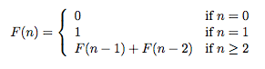

## 문제

피보나치 단어 수열은 다음과 같이 정의된다.

여기서 +는 두 문자열 이어 붙이는 것을 의미한다.

| n | F(n) |
| --- | --- |
| 0 | 0 |
| 1 | 1 |
| 2 | 10 |
| 3 | 101 |
| 4 | 10110 |
| 5 | 10110101 |
| 6 | 1011010110110 |
| 7 | 101101011011010110101 |
| 8 | 1011010110110101101011011010110110 |
| 9 | 1011010110110101101011011010110110101101011011010110101 |

비트 패턴 p와 정수 n이 주어졌을 때, F(n)에 p가 몇 번 나오는지 구하는 프로그램을 작성하시오.

## 입력

테스트 케이스의 첫째 줄에는 n(0 ≤ n ≤ 100)이 주어진다. 둘째 줄에는 비트 패턴 p가 주어진다. p의 길이는 최대 100,000이고 비어있지 않은 문자열이다.

## 출력

각각의 테스트 케이스에 대해서, 케이스 번호와 F(n)에서 비트 패턴 p가 몇 번 등장하는지 출력한다. 이런 등장은 겹칠 수 있다. 이 값은 263보다 작다.
