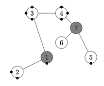

## 문제

You have been hired to construct a system to transport water between two points in an old factory building using some existing components of the old plumbing. The old components consist of pipes and junctions. Junctions are points where pipes may have previously been joined. We say previously joined, because some of the old pipes were damaged and have been removed, effectively leaving open holes in the junctions to which they were connected. If water should enter one of these junctions, it would pour out of an open hole and eventually flood the building—clearly an undesirable event.

You can remedy this situation by installing new pipes between some of the open holes and installing plugs to close other open holes as necessary. When you install a new pipe connecting two holes (which must be in two different junctions), the two holes are no longer open and water will be able to flow through the new pipe. The cost of installing a new pipe is equal to the distance between the centers of the two junctions the pipe connects. The cost of installing a plug in an open hole is 0.5. You are not concerned about open holes in junctions that will never be reached by water.

Two of the junctions are special. One, called the source, is the point where water will be pumped into the new system. The other, called the destination, is where the water is needed. After any plugs and new pipes have been added to the system, water will be pumped into it at the source with a pressure sufficient to reach a specified height (in the absence of leaks, of course). You are allowed to select the pressure arbitrarily, and are guaranteed that the pressure will not change during the operation of the system. Naturally the pressure must be sufficient to force water up to the heights of both the source and the destination. Your task is simply to find the most inexpensive way of getting water from the source junction to the destination junction without flooding the building.

The figure below corresponds to the first sample input case, where black dots represent open holes, junction 1 is the source, and junction 7 is the destination. (The position of a black dot on its circle has no significance and is used for illustration purposes only.)

Water flows through the system according to the laws of physics. If the pressure is sufficient to fill a junction with water, then that junction will remain filled with water. If there are pipes extending horizontally or downward from a junction, then water will also flow through those pipes. Water will also flow upward through pipes connected to a junction up to the height determined by the water pressure. Of course, if the water reaches an open hole in a junction, it will flow through the hole and flood the building.

In the first sample input case, you can connect junctions 1 and 5 at a cost of 3, plug the open holes in junction 2, and set the pressure so that the water flows up to junction 7 only. The water will fill junctions 1, 2, 5, 6 and 7, and will flow no higher. A different (more expensive) solution would be to simply plug all the holes at a total cost of 5, and let the water flow through all the junctions. You cannot solve this case by connecting junctions 1 and 6 and plugging holes in junctions 2 and 5, since junction 6 has no open holes to which a new pipe can be connected.

Assume existing pipes and any new pipes do not interfere with each other or with any junctions, except those to which they are connected. That is, even if a straight line from junction A to junction B passes through junction C, any pipe from A to B will not touch C.

## 입력

The first line of each test case contains two integers N and M, where N (2 ≤ N ≤ 400) is the number of junctions in the building (numbered 1 through N) and M (0 ≤ M ≤ 50 000) is the number of existing usable pipes. Each of the next N lines contains four integers xi, yi, zi, and ki satisfying -10 000 ≤ xi, yi, zi ≤ 10 000 and 0 ≤ ki ≤ 400, i = 1, 2, ..., N. The ith line describes junction i:(xi, yi, zi) is the location of the ith junction where the z-axis is the vertical axis, ki indicates the number of open holes in the junction. Each of the next M lines contains two integers aj and bj satisfying 1 ≤ aj < bj ≤ N. The jth line indicates that pipe j connects junctions aj and bj. At most one pipe connects any pair of junctions, and no two junctions share the same coordinates. The source is junction 1, and the destination is junction N.

## 출력

For each case, display the case number. Then if suitable new pipes and plugs can be used to construct the desired system, display the minimum cost of connecting the source junction to the destination junction, accurate to four decimal places. If it is impossible to connect the source to the destination, display the word impossible.
