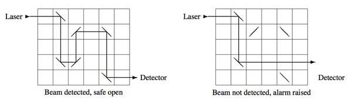

## 문제

주식회사 금고는 매우 안전한 금고를 만드는 회사이다. 금고사의 최신 금고는 빛을 이용한다. 직사각형 그리드에 거울을 적절히 넣고, 레이저를 발사해 감지기에 레이저가 감지되는지를 확인한다.

레이저는 그리드의 가장 윗 행의 왼쪽에서 발사된다. 레이저가 거울을 만난 경우에 레이저는 반사된다. 모든 거울은 45도 대각선 방향 (\ 또는 /)이다. 레이저가 가장 아랫 행의 오른쪽으로 빠져 나올 때(왼쪽 그림), 금고가 열린다. 그 외의 경우에는 알람이 울린다.

모든 금고에는 거울이 한 개씩 빠져있다. (오른쪽 그림) 사용자는 거울 한 개를 비어있는 칸에 넣는다. 올바른 사용자는 거울의 정확한 위치와 모양 (4행 3열, /)을 알고 있기 때문에, 금고를 안전하게 열 수 있다.

금고의 정보가 주어졌을 때, 금고가 안전한지 아닌지 구하는 프로그램을 작성하시오. 안전한 금고는 거울을 넣지 않았을 때 열리면 안되며, 금고를 열 수 있는 거울의 위치와 모양이 적어도 한 개는 존재한다.

## 입력

입력은 여러 개의 테스트 케이스로 이루어져 있고 각 테스트 케이스는 금고 하나를 나타낸다.

테스트 케이스의 첫째 줄에는 네정수 r, c, m, n이 주어진다. (1 ≤ r,c ≤ 1,000,000, 0 ≤ m,n ≤ 200,000) 금고는 r행 c열로 이루어져 있다.

다음 m개 줄에는 두 정수 ri와 ci (1 ≤ ri ≤ r, 1 ≤ ci ≤ c)가 주어지며, ri행 ci 열에 /모양의 거울이 있다는 뜻이다.

다음 n개 줄에도 \모양 거울의 정보가 주어지며, /모양 정보와 같은 방식으로 주어진다.

모든 m+n개의 위치는 서로 다르다.

## 출력

각 테스트 케이스마다, 테스트 케이스 번호를 출력하고 다음을 출력한다.

* `0` 거울을 삽입하지 않고 금고를 열 수 있을때
* `k r c` 거울을 넣지 않으면 금고가 열리지 않고, 금고를 열 수 있는 위치의 수가 k개, 그 중 가장 사전순으로 앞서는 위치가 (r, c)인 경우 (한 위치에 /와 \ 모양의 거울을 넣을 수 있는 경우에 위치 1개로 센다)
* `impossible` 거울을 넣어도 금고를 열 수 없는 경우
