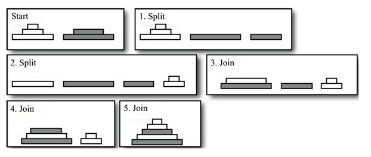

## 문제

욕심쟁이 순살 배송 Company 는 이름에서 알 수 있듯이 독점적으로 그릇을 배송하는 인터넷 소매 업체이다. 순살은 많은 제조 업체의 저녁 식사 그릇의 폭 넓은 선택을 제공하는 자신을 자랑스러워 한다.

최근에 순살은 비용에 관한 분석을 통해 배송을 하기 위해 포장하는데 많은 비용이 지출된다는 것을 발견했다. 배송을 하기 전에 그릇을 쌓는데  이때 쌓는 시간이 예상보다 오래 걸리는 것이 이유였다. 우리는 이런 순살을 위해 도움을 주려고 한다.

배송되는 그릇들은 여러 제조업체 의 그릇으로 이루어져 있다. 각각의 배송 업체들의 그릇은 쌓여진 채로 온다. 이때 이미 그릇은 위에서 가장 작은거 부터 아래로 가장 큰 걸로 정렬되어 있다. 우리는 순살을 위해 여러 제조 업체가 보내온 여러 개의 정렬된 그릇 더미들을 하나의 정렬된 그릇 더미로 만들어야 한다. 그릇을 하나의 더미로 만들때 두 가지의 동작을 할 수 있다.

* 분할: 하나의 더미를 두개의 더미로 나눈다.
* 결합: 두 개의 더미를 하나로 합친다. 이때 위에 쌓인 그릇의 크기는 아래 쌓인 그릇의 크기보다 작거나 같아야 한다.

그릇 더미의 모든 부분이 다른 더미 위에 곧바로 쌓을 수 없을 때에는 분할을 한뒤 일부분만 결합을 해야한다.  아래 그림은 첫 번째 예제를 나타낸다.

그릇 더미들이 주어질 때 단일 더미로 쌓는데 필요한 분할과 결합의 횟수를 구하여라.

## 입력

각각의 테스트 케이스 첫째 줄에 정수 n이 주어진다 (1 ≤ n ≤ 50).  n은 제조 업체에서 보낸 그릇 더미의 수를 나타낸다. 뒤이어 n개의 줄에는 각각 더미의 높이를 나타내는 h와 뒤이어 더미의 꼭대기 부터 밑까지 h (1 ≤ h ≤ 50) 개의 지름이 순서대로 주어진다. 모든 지름은 최대 10,000 이다. 이때 h개의 숫자는 비 내림차순으로 주어진다.

## 출력

각각의 테스트 케이스에 대해서 하나의 그릇 더미로 만드는데 필요한 분할과 결합의 최소 횟수를 출력한다.출력 형식은 예제를 참조한다.
