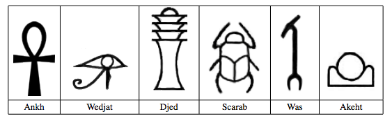
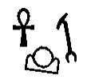
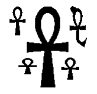

## 문제

고고학자는 초기 문명을 이해하기 위해서 고대 언어로 된 글을 공부하기도 한다.

이집트는 3000년전에 각종 동물이나 사물, 신체의 모습을 본딴 고대 언어 "신성 문자"를 만들었다.

이 문제에서, 아래와 같은 글자 여섯개를 인식하는 프로그램을 작성하시오.

## 입력

입력은 여러 개의 테스트 케이스로 이루어져 있다. 각 테스트 케이스는 하나 또는 그 이상의 신성 문자를 포함하는 그림으로 이루어져 있다. 그림은 1 또는 0으로 이루어져 있고, 1은 검정 픽셀, 0은 흰색 픽셀이다.

입력 데이터에서 각각의 줄은 16진수로 인코딩 되어 있다. 예를 들어, 여덟 픽셀 10011100은 9c로 인코딩 되어 있다. 16진수 인코딩에서 사용되는 문자는 0-9와 a-f이다.

첫 줄은 H와 W로 이루어져 있다. H(0 < H ≤ 200)는 줄의 수, W(0 < W ≤ 50)는 각 줄에 있는 16진수 문자의 개수이다. 다음 H개의 줄에는 그림이 주어진다. 입력으로 주어지는 그림은 다음과 같은 규칙을 만족한다.

1. 이미지는 문제의 설명에 주어진 6개의 신성 문자만 포함한다.
2. 모든 이미지는 적어도 1개의 올바른 신성 문자를 포함한다.
3. 모든 검정 픽셀은 올바른 신성 문자의 일부이다.
4. 신성 문자는 검정 픽셀이 이어진 형태이다. 모든 검정 픽셀의 위, 아래, 왼쪽, 오른쪽 픽셀 중 하나는 검정 픽셀이다.
5. 신성 문자는 서로 접하지 않으며, 한 문자 안에 또다른 문자가 포함된 경우는 없다.
6. 두 검정 픽셀이 대각선 방향으로 접한다면, 항상 두 픽셀은 공통으로 접하는 검정 픽셀이 있다.
7. 신성 문자는 비뚤어져 있을 수도 있다. 하지만, 그 모양은 항상 문제에 주어진 그림과 같다.

마지막 테스트 케이스의 다음에는 0 2개가 주어진다.

## 출력

각각의 테스트 케이스에 대해서, 케이스 번호를 출력한 뒤, 이미지에 쓰여 있는 신성 문자를 출력하나. 이때, 다음과 같은 코드를 사용한다.

* Ankh: A
* Wedjat: J
* Djed: D
* Scarab: S
* Was: W
* Akhet: K

이미지에 쓰여 있는 문자를 알파벳 순서대로 출력하며, 예제 출력의 형식을 따르면 된다.

## 힌트

첫 번째 예제: 

두 번째 예제: 
