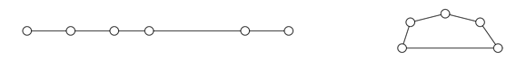

## 문제

Magic was accepted by all ancient peoples as a technique to compel the help of divine powers. In a well-known story, one group of sorcerers threw their walking sticks on the floor where they magically appeared to turn into live serpents. In opposition, another person threw his stick on the floor, where it turned into a serpent which then consumed the sorcerers’ serpents!

The only magic required for this problem is its solution. You are given a magic stick that has several straight segments, with joints between the segments that allow the stick to be folded. Depending on the segment lengths and how they are folded, the segments of the stick can be arranged to produce a number of polygons. You are to determine the maximum area that could be enclosed by the polygons formed by folding the stick, using each segment in at most one polygon. Segments can touch only at their endpoints. For example, the stick shown below on the left has five segments and four joints. It can be folded to produce a polygon as shown on the right.

## 입력

The input contains several test cases. Each test case describes a magic stick. The first line in each test case contains an integer n (1 ≤ n ≤ 500) which indicates the number of the segments in the magic stick. The next line contains n integers S1, S2, ..., Sn (1 ≤ Si ≤ 1000) which indicate the lengths of the segments in the order they appear in the stick.

The last test case is followed by a line containing a single zero.

## 출력

For each case, display its case number followed by the maximum total enclosed area that can be obtained by folding the magic stick at the given points. Answers within an absolute or relative error of 10-4 will be accepted.

Follow the format of the sample output.
