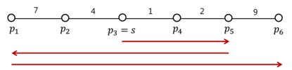

## 문제

명우는 보안 업체의 직원이고, 강남역에 있는 상점 여러 개를 도보로 순찰하는 업무를 맡고 있다.

강남역은 선분으로 나타낼 수 있고, 명우의 회사와 상점은 왼쪽부터 순서대로 선분 위의 점 pi로 나타낼 수 있다. 회사는 pa에 있고, s로 나타낸다. 명우는 s에서 순찰을 시작해서, 모든 상점 pi를 적어도 한 번 방문해야 한다. 각각의 i에 대해서, pi와 pi+1사이를 오가는데 걸리는 시간은 t[pi,pi+1]이다. pi의 대기 시간 ℓi는 s를 출발해서 pi에 처음 도착하기 까지 걸린 시간이다. 시작점 s = pa의 대기 시간 ℓa는 0이다. 명우는 모든 상점의 대기 시간의 합이 최소가 되게 하기 위해 순찰을 해야 한다.

아래 그림에는 총 6개의 상점 p1부터 p6까지가 있고, 시작점 s는 p3이다. 또, t[p1,p2] = 7, t[p2,p3] = 4, t[p3,p4] = 1, t[p4,p5] = 2, t[p5,p6] = 9이다. 명우가 s에서 오른쪽으로 걷기 시작한다면, 대기 시간 ℓ4와 ℓ5는 1과 3이 된다. 아래 그림에 나와있는 순서대로 순찰을 한다면, 대기 시간의 합은 71이 된다. 71보다 대기 시간의 합을 줄이는 방법은 없다.

점의 수 N과, pi와 pi+1 사이를 오가는데 걸리는 시간 t[pi,pi+1] (t = 1,...,N-1)이 주어졌을 때, 대기 시간을 최소로 하는 프로그램을 작성하시오.

## 입력

첫째 줄에 테스트 케이스의 개수 T가 주어진다. 각 테스트 케이스의 첫째 줄에는 상점의 수 N (1 ≤ N ≤ 100)이 주어진다. 둘째 줄에는 시작점의 위치 a (1 ≤ a ≤ N)가 주어진다. a번째 점, pa = s가 시작점이 된다. 다음 N-1개 줄의 i번째 줄에는 t[pi,pi+1]가 주어진다. (1 ≤ t[pi,pi+1] ≤ 15,000,000)

## 출력

각 테스트 케이스 마다, 모든 가게를 순찰하는 모든 순찰 방법 중 대기 시간의 최솟값을 출력한다.
